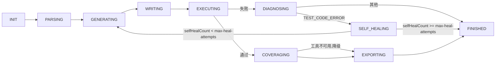
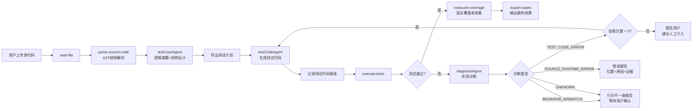
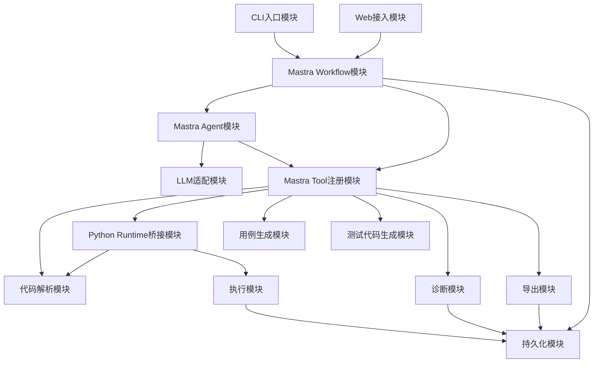

# 测试用例生成Agent — 概要设计文档

> **版本**：V3.1   **日期**：2026-06-11   **状态**：完善稿（已对齐实际实现）
>
> **对应需求**：见《需求分析文档》
>
> **核心范式**：LLM + 工具集 + 自主调用机制的智能体架构

***

## 目录

| 章节           | 内容                 |
| ------------ | ------------------ |
| 1 系统架构       | 分层架构、技术栈、模块划分、数据流  |
| 2 核心设计原则     | 架构决策与约束            |
| 3 工具集总览      | 工具清单、阶段归属、风险等级     |
| 4 Agent 运行机制 | 循环机制、状态机、退出条件      |
| 5 安全防护体系     | 多层防护架构             |
| 6 模块设计       | 核心模块职责、输入输出、依赖关系   |
| 7 数据与部署设计    | 存储分层、部署形态、目录规划     |
| 8 接口边界       | CLI、Web、工具和LLM接口边界 |

***

## 1 系统架构

### 1.1 系统架构总览


> 图1-1：Agent系统架构图

系统采用 **Mastra + 多语言 Runtime** 的双层架构。Mastra作为TypeScript侧的Agent工程框架，负责Agent定义、Workflow编排、Tool注册、Guardrails、人工审批和可观测调试；Python Runtime负责Python源代码AST解析、pytest执行、traceback采集和后续执行沙箱能力；Java/C++ 适配器在 V2.0 起通过 `Language Adapter` 模式接入，Java 走 `mvn verify` + JaCoCo，C++ 走 gtest + gcov/gcovr，产物统一封装为 `ExecutionResult`。系统由五大核心层组成，分层设计确保各层职责清晰、可独立演进：

**用户接入层**：CLI 入口由 Mastra 承担（`src/cli.ts`，`npm run generate`），支持 `.py` / `.java` / `.cpp` 源文件，提供命令行、自然语言交互（`--interactive`）、自主 Agent（`--autonomous`）三种模式；V3.0 提供 Web 页面上传源代码文件或粘贴代码片段。

**Agent核心层**：基于Mastra Agent和Mastra Workflow实现。Workflow负责解析、生成、执行、覆盖率采集、诊断、自愈、导出的确定性主流程；Agent负责测试策略、逻辑摘要、测试代码生成和失败诊断等需要LLM判断的环节。确定性的代码结构提取由 Python AST 或语言解析器完成，避免完全依赖LLM解析代码。

**工具能力层**：工具能力层以Mastra Tool形式注册，每个工具使用Schema定义入参和出参。AST解析、文件写入、对应语言测试执行、覆盖率采集、导出等能力应尽量确定化；逻辑摘要、测试策略、失败诊断等能力可以由LLM参与，但必须输出结构化结果，便于记录、重试和验收。

**执行层**：V1.0阶段使用临时工作目录和子进程（subprocess）运行对应语言测试框架，捕获标准输出、标准错误、退出码、执行耗时与逐用例结果。Python 默认超时60秒；Java/C++ 走 Language Adapter，默认180秒，防止首次冷启动/编译耗尽资源。该阶段仅面向可信代码，不宣称强安全隔离。

**数据持久层**：V1.0可以先使用文件系统和本地JSON保存输入、输出和导出文件；V3.0引入MySQL（Prisma ORM）存储用户账户、会话、消息、任务、文件元信息和工作空间。Redis 缓存属后续规划，当前版本未引入，运行态由进程内 InMemoryStore 承担。

### 1.1.1 技术栈选型

| 架构部分      | 技术选型                                       | 说明                                                             |
| --------- | ------------------------------------------ | -------------------------------------------------------------- |
| Agent框架   | Mastra                                     | 提供Agent、Workflow、Tools、Guardrails、Approval、Studio调试和Server部署能力 |
| 编排语言      | TypeScript                                 | Mastra项目主体语言，用于编写Agent、Workflow、Tool和Web/API集成                 |
| Python运行层 | Python 3.10+ / pytest / coverage.py         | 负责Python AST解析、pytest执行、coverage.py覆盖率采集、临时目录和traceback采集       |
| Java运行层   | Java 17+ / Maven 3.8+ / JUnit 5 / JaCoCo 0.8.12 | 负责Java源代码解析、mvn verify执行、JaCoCo覆盖率采集                              |
| C++运行层    | C++17 / g++ 17+ / GoogleTest / gcov          | 负责C++源代码解析、g++编译、gtest执行、gcov覆盖率采集                             |
| 测试框架      | pytest / JUnit 5 / GoogleTest              | 按语言分发，Language Adapter 决定测试代码模板                                      |
| 解析器       | Python `ast` / tree-sitter-java / tree-sitter-cpp | 按语言选用                                                            |
| Schema校验  | Zod / Standard JSON Schema                 | 定义Mastra Tool和Workflow Step的输入输出                               |
| V2.0+内存层 | InMemoryStore + session-state            | 会话期中间结果保存                                                        |
| V1.0存储    | 文件系统 + JSON                              | 保存源文件、测试代码、运行报告和导出索引                                           |
| V3.0存储    | MySQL（Prisma ORM）                          | MySQL保存业务历史；Redis 属后续规划，当前运行态由 InMemoryStore 承担                |

### 1.2 分层职责与依赖关系

```
┌─────────────────────────────────────────────┐
│              用户接入层                       │
│    CLI (V1.0)         Web (V3.0)             │
└────────────────────┬────────────────────────┘
                     │  HTTP / 命令行调用
┌────────────────────▼────────────────────────┐
│              Agent 核心层                     │
│  Mastra Agent + Workflow → Tool 调用与状态控制  │
└────────────────────┬────────────────────────┘
                     │ 工具调用 / 结果返回
┌────────────────────▼────────────────────────┐
│             工具能力层                         │
│ Mastra Tools / Python AST / pytest / 诊断 / 导出 │
└────────────────────┬────────────────────────┘
                     │ 子进程执行
┌────────────────────▼────────────────────────┐
│              执行沙箱层                        │
│ 临时目录 + command-runner + pytest/mvn/g++   │
│ (python-adapter / java-adapter / cpp-adapter) │
└────────────────────┬────────────────────────┘
                     │ 读写
┌────────────────────▼────────────────────────┐
│            数据持久层                          │
│ 文件系统(V1.0) / InMemoryStore(V2.0+) / MySQL+Prisma(V3.0) │
└─────────────────────────────────────────────┘
```

### 1.3 模块间通信方式

| 交互场景                         | 通信方式                                | 数据格式                     |
| ---------------------------- | ----------------------------------- | ------------------------ |
| Agent/Workflow → 工具          | Mastra Tool调用                       | 结构化参数（JSON/Zod Schema）   |
| 工具 → Agent                   | 函数返回值                               | 结构化结果（JSON）              |
| Agent → LLM                  | HTTP API调用                          | OpenAI Chat Completion格式 |
| LLM → Agent                  | HTTP响应中的 Tool Call                  | OpenAI Tool Call格式       |
| Mastra Tool → Python Runtime | `python-bridge.ts`（child_process / 标准输入输出） | JSON请求和JSON响应            |
| Mastra Tool → 外部 CLI         | `command-runner.ts`（mvn / g++ / gcov）    | 命令行参数 + 退出码 + 缓冲 stdout/stderr |
| Mastra Tool → Language Adapter | 直接函数调用                              | 统一 `ExecutionResult` / `SourceAnalysis` / `CoverageResult` |
| Language Registry → Adapter   | 按文件扩展名或 `--language` 路由            | 适配器实例                    |
| Agent → CLI 输出              | `cli-output` 显式 API                 | TTY/NO_COLOR/CI 适配的字符串    |
| Agent → 持久层                  | 文件IO / ORM                          | JSON / SQL               |

***

## 2 核心设计原则

### 2.1 原则一：LLM做决策，工具做执行

LLM不直接读写文件、不直接执行代码。它输出"我想调用工具X，参数是Y"，由自主调用机制分发执行并返回结果。

### 2.2 原则二：动态决策，状态机兜底

Agent可以根据上下文调整工具调用顺序，但必须受可观测状态机约束，至少包含解析、生成、执行、诊断、自愈、导出、结束等状态，避免LLM无限自由调用造成不可控循环。

### 2.3 原则三：自愈谨慎，带证据报告

测试代码执行失败后，Agent输出结构化诊断，包含诊断类型、置信度、证据和建议动作。只有当诊断为测试代码问题且置信度达到阈值时才自动自愈；无法判断时向用户报告，而不是强行认定为源代码Bug。

### 2.4 原则四：安全分阶段实现

V1.0阶段通过路径校验、临时目录、超时终止和文件写入范围限制降低风险；生产级网络隔离、CPU/内存限制和只读挂载应在后续容器化执行环境中实现。

***

## 3 工具集总览

### 3.1 完整工具清单

实际实现中，确定性能力以 **Mastra Tool** 形式注册（共 7 个），LLM 判断类能力（逻辑摘要、用例设计、代码生成、失败诊断）由 **Agent** 承担而非独立工具：

**已实现的 Mastra 工具（7 个，`src/mastra/tools/`）**

| 工具名称                | 所属阶段 | 用途                                         | 风险  |
| ------------------- | ---- | ------------------------------------------ | --- |
| `read-file`         | V1.0 | 读取指定路径的源代码文件或粘贴代码落盘后的临时文件（多语言）              | 低   |
| `parse-source-code` | V1.0 | Python 走 `ast`，Java/C++ 走 tree-sitter，提取模块、类、函数、参数、返回注解、docstring、行号 | 低   |
| `write-file`        | V1.0 | 将测试代码和导出结果写入指定输出目录                         | 中   |
| `execute-tests`     | V1.0 | 在临时目录中执行对应语言测试框架，返回执行结果、stdout、stderr、退出码、耗时与逐用例结果 | 中   |
| `coverage`          | V2.2 | 收集真实行/分支覆盖率（Python: coverage.py；Java: JaCoCo；C++: 预留 gcov） | 中   |
| `export-cases`      | V1.0 | 导出用例和测试代码为Markdown/.py/.java/.cpp            | 中   |
| `logger`            | V2.0 | 写入运行日志（output/logs/）                        | 低   |

**由 Agent（LLM）承担的能力（`src/mastra/agents/`）**

| 能力          | 承担 Agent                               | 说明                      |
| ----------- | -------------------------------------- | ----------------------- |
| 逻辑摘要 + 用例设计 | `testCaseAgent`                        | 按功能、边界、异常策略生成测试用例描述     |
| 测试代码生成      | `testCodeAgent` / `testCodeAgentPro`   | 快慢双通道，自愈重试切换 Pro 模型     |
| 失败诊断        | `diagnosisAgent` / `diagnosisAgentPro` | 输出诊断类型、置信度、证据和建议动作      |
| 诊断决策结构化     | `diagnosisDecisionAgent`               | 将自然语言诊断转为结构化决策（JSON）    |
| CLI 自然语言交互  | `cliAgent`                             | 理解用户指令、制定执行计划、决定下一步动作   |

**V3.0 规划工具（未以 Mastra Tool 形式实现，由 Web 后端 Service 层替代）**

| 工具名称                           | 说明                                    |
| ------------------------------ | ------------------------------------- |
| `context_search`               | 检索历史用例/诊断/版本——实际由 MySQL + Prisma 查询替代  |
| `db_read/insert/update/delete` | 数据库操作——实际由 `src/server/services/` 替代   |
| `log_create/update`            | 任务日志——实际由 Web 后端 task service 替代       |

> 注：测试代码版本管理（原规划 `create_test_code_version` 工具）实际在工作流内部以 `versions[]` 数组实现，每轮生成/自愈自动追加版本记录并写入最终报告。

### 3.2 工具风险等级与控制策略

| 风险等级 | 判定标准               | 控制策略          |
| ---- | ------------------ | ------------- |
| 低    | 仅读取数据，不产生副作用       | 直接执行，记录日志     |
| 中    | 写入文件或执行代码，但可回滚     | 参数校验 + 操作日志   |
| 高    | 不可逆操作（如db\_delete） | 护栏检查 + 弹出人工确认 |

### 3.3 Agent 状态机

Agent的运行受状态机约束，各状态定义如下：

| 状态            | 说明       | 执行者（工具 / Agent）                              | 退出条件        |
| ------------- | -------- | ------------------------------------------- | ----------- |
| INIT          | 初始化，读取输入 | read-file                                  | 解析完成或出错     |
| PARSING       | 代码解析中    | parse-source-code（ast / tree-sitter）        | 解析完成或出错     |
| GENERATING    | 测试生成中    | testCaseAgent（用例+逻辑摘要）, testCodeAgent（代码）   | 生成完成或出错     |
| WRITING       | 写入测试文件   | write-file + 工作流内部版本记录（versions[]）          | 写入完成或出错     |
| EXECUTING     | 测试执行中    | execute-tests（按语言分发到 Language Adapter） | 执行完成或超时     |
| COVERAGING    | 真实覆盖率采集中  | coverage 工具（coverage.py / JaCoCo；C++ 预留） | 采集完成或工具不可用（降级） |
| DIAGNOSING    | 失败诊断中    | diagnosisAgent + diagnosisDecisionAgent      | 诊断完成        |
| SELF\_HEALING | 自愈重试     | testCodeAgentPro（高精度重生成）                    | selfHealCount >= max-attempts 或修复成功 |
| EXPORTING     | 结果导出     | export-cases                                | 导出完成        |
| FINISHED      | 结束       | —                                           | —           |
| ERROR         | 不可恢复错误   | —                                           | —           |

边界常量：`--max-attempts = 3`（连续自愈最大轮数，可配置）、`max-rounds = 20`（Agent 总运行轮次上限）。

状态流转图：



***

## 4 Agent 运行机制

### 4.1 运行循环与自愈流程

Agent采用"感知→思考→行动→观察"循环机制，但运行必须受状态机约束。V1.0阶段先完成解析、生成、执行、质量检查和导出；V2.0在测试失败时增加诊断与自愈；V3.0再将任务状态和历史结果持久化。



> 图4-1：Agent自愈循环流程（质量约束由生成阶段的 prompt 内嵌规则保证，不再设独立 check_quality 节点）

### 4.2 退出条件定义

| 编号   | 退出条件                                | 触发场景              | Agent行为           |
| ---- | ----------------------------------- | ----------------- | ----------------- |
| EC-1 | LLM返回不含工具调用的直接响应                    | Agent判断任务已完成      | 将响应作为最终输出呈现       |
| EC-2 | 工具返回 `__final__: true`              | 测试全部通过            | 输出最终结果            |
| EC-3 | 工具执行不可恢复错误                          | 执行环境崩溃等           | 向用户报告错误           |
| EC-4 | 达到最大轮次（20轮）                         | 循环超限              | 返回中间结果            |
| EC-5 | 连续自愈失败3轮                            | 测试代码持续无法修正        | 报告用户，建议人工介入       |
| EC-6 | 诊断为 `SOURCE_RUNTIME_ERROR`          | 源代码执行时报错          | 输出错误位置+原因+证据+复现步骤 |
| EC-7 | 诊断为 `BEHAVIOR_MISMATCH` 或 `UNKNOWN` | 预期与实际行为不一致或无法可靠判断 | 输出差异报告，等待用户确认     |
| EC-8 | 质量约束不满足且无法自愈                     | 测试通过但断言质量不合格      | 返回测试质量问题和当前版本     |
| EC-9 | 测试通过且真实覆盖率采集完成                | measure_coverage 已产出 line_rate / branch_rate / per_file / report_path | 输出文件、测试代码、执行摘要、覆盖率报告 |

### 4.3 核心运行流程说明

1. 用户上传源代码文件或粘贴代码，Language Registry 按扩展名（`.py`/`.java`/`.cpp`/`.cc`/`.cxx`/`.hpp`/`.h`）或 `--language` 参数路由到对应 Language Adapter，Agent 调用 `read-file` 读取内容
2. Agent 调用 `parse-source-code`，由 Language Adapter 按语言分发：Python 走 `ast`，Java 走 tree-sitter，C++ 走 tree-sitter；提取模块/类/函数/参数/返回注解/docstring/行号/import，Java 额外记录注解与 modifier，C++ 额外记录 namespace
3. 工作流调用 `testCaseAgent`（LLM）生成函数逻辑摘要、输入约束、分支说明和测试用例描述
4. 工作流先导出测试计划文档（export-cases-plan 步骤）
5. 工作流调用 `testCodeAgent`（LLM）将测试用例转化为对应语言测试代码（pytest / JUnit 5 / GoogleTest）
6. 工作流在内部 `versions[]` 数组中记录当前测试代码版本
7. 工作流调用 `write-file` 将测试代码写入指定输出目录
8. 工作流调用 `execute-tests`，由 Language Adapter 按语言分发到 `pytest` / `mvn verify` / gtest 二进制，采集 passed/failed/errors/stdout/stderr/exit_code/duration_ms 与 `test_results` 逐用例列表
9. 测试全部通过后，调用 `coverage` 工具采集真实行/分支覆盖率（Python coverage.py / Java JaCoCo / C++ 预留），quality-check 由 LLM 在生成阶段内嵌 prompt 约束替代
10. 工作流调用 `export-cases` 按语言输出 `.py`/`.java`/`.cpp` + `.md` 到 `output/exports/{testpy*,testjava*,testcpp*}/`
11. 如果测试失败，调用 `diagnosisAgent`（自愈重试时切换 `diagnosisAgentPro`）分析失败输出，再由 `diagnosisDecisionAgent` 转为结构化决策，按语言分写复现命令，返回诊断类型、置信度、证据和建议动作
12. 若诊断为 `TEST_CODE_ERROR` 且置信度达到阈值，由 `testCodeAgentPro` 重新生成测试代码并进入自愈循环
13. 若诊断为 `SOURCE_RUNTIME_ERROR`，Agent输出错误位置、异常原因、堆栈证据和复现命令
14. 若诊断为 `BEHAVIOR_MISMATCH` 或 `UNKNOWN`，Agent不强行判定源代码Bug，输出行为差异和需要用户确认的点
15. 达到最大轮次（20轮）或连续自愈失败 `--max-attempts` 轮（默认3）时强制退出，返回当前结果和失败原因

### 4.4 工作流实际步骤（generate-test-workflow.ts）

上述状态机在实际实现中落地为 7 个确定性 Step 的链式工作流：

```
read-parse-source → design-test-cases → export-cases-plan → generate-test-code
  → execute-tests → self-healing → export-results
```

| Step ID             | 对应状态               | 说明                                  |
| ------------------- | ------------------ | ----------------------------------- |
| `read-parse-source` | INIT + PARSING     | 读取源文件并按语言完成 AST 解析                  |
| `design-test-cases` | GENERATING         | `testCaseAgent` 设计用例（含逻辑摘要）         |
| `export-cases-plan` | GENERATING         | 先导出测试计划文档                           |
| `generate-test-code`| GENERATING+WRITING | `testCodeAgent` 生成代码并记录版本           |
| `execute-tests`     | EXECUTING          | 按语言适配器执行测试                          |
| `self-healing`      | DIAGNOSING+SELF_HEALING+COVERAGING | 失败诊断→重生成→重执行循环，通过后采集覆盖率 |
| `export-results`    | EXPORTING          | 导出最终代码 + Markdown 报告（含覆盖率、版本历史）     |

### 4.5 自主 Agent 模式（V3.1）

与上述工作流模式并行，V3.1 新增**自主 Agent REPL 模式**（`src/autonomous/`，`npm run agent` 或 `--autonomous` 启动）：LLM 不再是流程中的固定节点，而是自主决策大脑，通过多轮工具调用（9 个工具：read/write/parse/execute/coverage/export/logger/shell/ask）完成用户的自然语言任务。shell 命令执行总是经过 y/n/always/never 人工审批，命令风险评级由 `safety.ts` 完成。该模式不引用 generate-test-workflow 的任何代码，仅复用日志、CLI 输出、记忆、工具工厂等基础设施。

***

## 5 安全防护体系

### 5.1 多层防护架构

1. **身份认证层（V3.0）**：JWT Token验证，Token过期检查（24小时），请求频率限制
2. **访问控制层（V3.0）**：数据隔离（用户只能访问自己的数据和代码），工具级权限检查
3. **护栏检查层（V1.0起）**：工具执行前进行路径、文件类型、输出目录和风险等级校验；高风险操作弹出人工确认或直接拒绝
4. **执行隔离层（V1.0起）**：测试代码在临时工作目录的子进程中执行；执行超时自动终止（默认60秒）；仅允许向指定输出目录写入生成文件

### 5.2 沙箱执行安全约束

| 约束项  | V1.0策略                         | 说明                |
| ---- | ------------------------------ | ----------------- |
| 执行超时 | Python 60 秒后自动终止 pytest 子进程；Java/C++ 走 Language Adapter，默认 180 秒（首次冷启动下载/编译留余量） | 可实现，必须记录 timeout 状态 |
| 路径隔离 | 使用临时目录复制源文件和测试文件，仅允许输出目录写入     | 可实现，防止误写项目外文件     |
| 文件类型 | V1.0 仅允许 `.py` 输入和 `.py/.md` 输出；V2.0 起扩展为 `.py/.java/.cpp` 输入和 `.py/.java/.cpp/.md` 输出 | 可实现，降低输入风险        |

V1.0阶段仅适用于可信代码或本地个人使用场景。

***

## 6 模块设计

### 6.1 模块划分总览

| 模块                 | 所属层      | 主要职责                                   | 阶段        |
| ------------------ | -------- | -------------------------------------- | --------- |
| CLI入口模块            | 用户接入层    | 解析命令行参数、读取输入路径、指定输出目录、展示运行摘要           | V1.0      |
| CLI对话Agent模块       | 用户接入层    | 在CLI内承接用户自由输入的指令（重新生成/调整覆盖率/调整诊断等），输出结构化决策 | V2.0      |
| Web接入模块            | 用户接入层    | 登录注册、文件上传、代码粘贴、历史任务查询                  | V3.0      |
| CLI输出与颜色模块        | 用户接入层    | 统一封装Agent/Info/Warn/Error/进度条输出，自动适配TTY/NO_COLOR/CI | V2.0      |
| Mastra Workflow模块  | Agent核心层 | 维护状态机、控制主流程、组织解析/生成/执行/诊断/自愈步骤         | V1.0起     |
| Mastra Agent模块     | Agent核心层 | 承载逻辑摘要、用例生成、测试代码生成、失败诊断等LLM能力          | V1.0起     |
| LLM适配模块            | Agent核心层 | 统一封装模型请求、Tool Call响应、重试和错误转换           | V1.0起     |
| Mastra Tool注册模块    | 工具能力层    | 注册工具元信息、风险等级、Zod入参出参结构和执行函数            | V1.0起     |
| Python Runtime桥接模块 | 工具能力层    | 在TypeScript工具中调用Python脚本或服务，并解析JSON返回  | V1.0      |
| 语言适配器模块           | 工具能力层    | 以统一接口封装Python/Java/C++的解析、执行、诊断、导出能力     | V2.0      |
| 代码解析模块             | 工具能力层    | 使用Python AST或语言解析器解析函数、类、方法、行号和import依赖 | V1.0      |
| 用例生成模块             | 工具能力层    | 根据AST和逻辑摘要生成测试用例文档                     | V1.0      |
| 测试代码生成模块           | 工具能力层    | 生成对应语言的测试代码（pytest / JUnit 5 / gtest），结合mock、fixture和边界用例 | V1.0      |
| 执行模块               | 执行层      | 按语言分发到python-adapter/java-adapter/cpp-adapter，创建临时目录、运行测试、捕获stdout/stderr/退出码/耗时/逐用例结果 | V1.0      |
| 覆盖率模块              | 工具能力层    | 收集真实行/分支覆盖率（coverage.py / JaCoCo / gcov+gcovr），与execute_tests解耦但同生命周期 | V2.0      |
| 诊断模块               | 工具能力层    | 对失败结果分类，输出置信度、证据和建议动作                  | V2.0      |
| 版本管理模块             | 数据持久层    | 保存每轮测试代码版本、执行结果和诊断结果                   | V2.0      |
| 导出模块               | 工具能力层    | 导出Markdown和对应语言测试文件                   | V1.0      |
| 持久化模块              | 数据持久层    | 管理文件系统、JSON、InMemoryStore和MySQL（Prisma）读写 | V1.0/V3.0 |

### 6.2 核心模块依赖



### 6.3 模块输入输出

| 模块                 | 输入                               | 输出                   |
| ------------------ | -------------------------------- | -------------------- |
| Mastra Workflow模块  | 用户请求、当前状态、工具结果                   | 下一步动作、最终响应、状态记录      |
| Mastra Agent模块     | Workflow步骤输入、工具结果、上下文            | 结构化摘要、用例、测试代码、诊断结论   |
| CLI对话Agent模块       | 用户自由输入、当前任务状态、覆盖率结果             | 结构化决策（重生成/调整/确认等）    |
| CLI输出与颜色模块        | 日志级别、消息文本、进度参数                   | 带颜色/无颜色的终端输出         |
| Python Runtime桥接模块 | TypeScript工具请求、Python脚本路径、JSON参数 | Python工具JSON结果或结构化错误 |
| 语言适配器模块           | 语言标识、源文件、测试代码、执行参数                | 统一 `ExecutionResult` / `SourceAnalysis` |
| 代码解析模块             | 源文件路径或源码文本                       | AST结构、符号列表、语法错误      |
| 用例生成模块             | 符号列表、逻辑摘要、需求文本                   | 测试用例列表               |
| 测试代码生成模块           | 测试用例、符号信息、源文件路径                  | 对应语言测试代码文本           |
| 执行模块               | 源文件、测试文件、超时配置、语言                 | 执行结果结构（含逐用例结果）       |
| 覆盖率模块              | 执行产物（.exec / .gcda）、源文件目录        | 真实行/分支覆盖率、覆盖/未覆盖符号   |
| 诊断模块               | 执行结果、traceback、测试代码版本、AST信息      | 诊断类型、置信度、证据、建议动作     |
| 版本管理模块             | 测试代码、执行结果、诊断结果                   | 版本号、状态、关联记录          |
| 导出模块               | 用例、测试代码、执行结果、诊断结果、覆盖率            | 导出文件路径               |

### 6.4 状态与模块映射

| 状态            | 主责模块                                  | 关键输出          |
| ------------- | ------------------------------------- | ------------- |
| INIT          | CLI入口模块 / Web接入模块 / Mastra Workflow模块 | 标准化输入请求       |
| PARSING       | 代码解析模块 / 语言适配器模块                      | 源码符号结构        |
| GENERATING    | 用例生成模块 / 测试代码生成模块                     | 用例列表、对应语言测试代码 |
| WRITING       | 版本管理模块 / 持久化模块                        | 版本记录、文件路径     |
| EXECUTING     | 执行模块 / 语言适配器模块                        | 对应语言执行结果     |
| COVERAGING    | 覆盖率模块 / 语言适配器模块                       | 真实行/分支覆盖率    |
| DIAGNOSING    | 诊断模块                                  | 失败诊断结果        |
| SELF\_HEALING | Agent编排模块 / 测试代码生成模块                  | 新测试代码版本       |
| EXPORTING     | 导出模块                                  | 导出文件          |
| FINISHED      | Mastra Workflow模块                     | 最终响应          |
| ERROR         | Mastra Workflow模块                     | 结构化错误         |

***

## 7 数据与部署设计

### 7.1 存储分层设计

| 存储介质   | 适用阶段  | 存储内容                        | 设计说明                |
| ------ | ----- | --------------------------- | ------------------- |
| 文件系统   | V1.0起 | 源代码、测试代码、导出文件               | 最小可运行方案，便于本地调试和结果查看 |
| 本地JSON | V1.0  | 任务结果、执行结果、导出索引              | 作为无数据库情况下的轻量记录      |
| InMemoryStore | V2.0起 | 会话记忆、上下文摘要、运行态           | 进程内存储，进程退出即失效        |
| MySQL  | V3.0  | 用户、会话、消息、任务、文件、工作空间、API Key | Prisma ORM，支撑多用户和长期历史记录 |
| Redis  | 规划中   | 运行中状态、工具中间结果、短期消息           | 后续多实例部署时引入，当前未实现     |

### 7.2 部署形态

| 阶段   | 部署形态                             | 说明                                                         |
| ---- | -------------------------------- | ---------------------------------------------------------- |
| V1.0 | Mastra本地开发服务 + Python Runtime    | Mastra负责Workflow和Tools，Python脚本负责AST解析和pytest执行，结果通过JSON返回 |
| V2.0 | Mastra Workflow增强版               | 增加诊断Agent、自愈循环和测试代码版本管理，仍以文件系统/JSON为主                      |
| V3.0 | Express Web服务 + 前端 + 数据库 | Express 接收请求并运行 Agent/Workflow，MySQL（Prisma）保存历史，前端 React+Vite |
| V3.1 | 自主 Agent REPL（本地）        | `npm run agent` 启动，LLM 多轮工具调用 + 命令人工审批                       |

### 7.3 V1.0目录规划

```text
output/
├── sources/                 # 输入源代码副本
├── tests/                   # 生成的测试代码
├── reports/                 # 执行结果、诊断结果、本地JSON记录
└── exports/                 # 测试代码和.md文档导出文件
    ├── testpy/              #  Python 用例导出目录
    │   ├── test_generated.py
    │   └── test_cases.md
    ├── testjava1/           #  Java 用例导出目录
    │   ├── TestSourceSmallTest.java
    │   └── test_cases.md
    └── testcpp1/            #  C++ 用例导出目录
        ├── test_source_small.cpp
        └── test_cases.md
```

### 7.4 V3.0服务划分

| 服务                        | 职责                                | 实现位置                       |
| ------------------------- | --------------------------------- | -------------------------- |
| Express Web API 服务        | 用户认证、文件上传、任务创建、历史查询、结果下载、SSE 流式推送 | `src/server/`              |
| Agent/Workflow 执行器        | 执行Workflow、工具调用、诊断和自愈             | `src/server/services/agent-executor.ts` / `workflow-executor.ts` |
| Python Runtime            | 执行AST解析、pytest运行、traceback采集和沙箱隔离 | `python-runtime/`          |
| MySQL（Prisma）             | 保存长期业务数据                          | `prisma/schema.prisma`     |
| 前端应用                      | 仪表盘、对话、文件、工作空间、会话历史管理             | `client/`                  |
| 文件存储                      | 保存源文件、测试代码文件和导出文件                 | `uploads/` + `output/`     |

***

## 8 接口边界

### 8.1 CLI接口

CLI 入口为 `src/cli.ts`，编译后通过 `npm run generate`（或 `node dist/cli.js`）启动，支持命令行、自然语言交互、自主 Agent 三种模式：

```bash
# 命令行模式
npm run generate -- --input src/user_service.py --output output/exports

# 自然语言交互模式
npm run generate -- --interactive

# 自主 Agent REPL 模式
npm run agent
```

| 参数                    | 简写        | 必填 | 说明                                                |
| --------------------- | --------- | -- | ------------------------------------------------- |
| `--input`             | `-i`      | 否* | 源代码文件路径（支持 `.py`/`.java`/`.cpp`/`.cc`/`.hpp`/`.h`） |
| `--output`            | `-o`      | 否  | 输出目录，默认 `./output/exports`                        |
| `--language`          | `-l`      | 否  | 显式指定语言（python / java / cpp），缺省按扩展名推断              |
| `--max-attempts`      | -         | 否  | 最大自愈尝试次数，默认 3                                     |
| `--llm-retries`       | -         | 否  | 每次 LLM 请求的重试次数，默认 2                               |
| `--requirements`      | -         | 否  | 额外需求文本，用于增强预期结果生成                                 |
| `--requirements-file` | -         | 否  | 从文件读取额外需求                                         |
| `--interactive`       | `-I`      | 否  | 自然语言交互模式                                          |
| `--autonomous`        | `--agent` | 否  | 自主 Agent REPL 模式                                  |

> *`--input` 在命令行模式下必填；交互/自主模式下通过对话指定。覆盖率采集默认随执行自动进行，无需单独参数。

### 8.2 Web接口边界

Web 接口已于 V3.0 实现（`src/server/`，Express + Prisma + MySQL，统一前缀 `/api/v1`），详细规格见《API接口设计文档》（docs/）。

| 接口类别    | 典型能力                           | 实现状态 |
| ------- | ------------------------------ | :--: |
| 用户接口    | 注册、登录、获取当前用户信息                 | ✅    |
| LLM配置接口 | 保存、更新、读取用户模型配置                 | ✅    |
| 源码接口    | 上传文件、粘贴代码、查看源文件列表              | ✅    |
| 任务接口    | 创建生成任务、查询运行状态、查看历史任务           | ✅    |
| 会话接口    | 创建会话、发送消息、SSE 流式推送 Agent 输出     | ✅    |
| 工作空间接口  | 管理项目工作目录、浏览目录、选择文件             | ✅    |
| 结果接口    | 查看测试用例、测试代码版本、执行结果、诊断结果、下载导出文件 | ✅    |

### 8.3 工具接口边界

工具接口基于Mastra Tool实现，必须满足三项约束：输入输出结构化、错误结构化、风险等级可审计。Agent和Workflow只能通过Mastra工具注册表调用工具，不直接调用模块内部实现。

| 字段             | 说明          |
| -------------- | ----------- |
| name           | 工具唯一名称      |
| stage          | 所属阶段        |
| risk\_level    | 低/中/高       |
| input\_schema  | JSON形式的入参约束 |
| output\_schema | JSON形式的返回结构 |
| handler        | 工具实际执行函数    |

### 8.3.1 TypeScript调用Python工具约定

需要调用Python生态能力的Mastra Tool通过统一桥接层执行Python脚本或Python服务。桥接层负责序列化输入JSON、启动Python进程、读取stdout中的JSON响应、处理stderr和退出码，并将结果转换为Mastra工具返回结构。

```text
Mastra Tool(TypeScript)
  -> Python Runtime Bridge
  -> python-runtime/parse_source.py 或 run_pytest.py
  -> JSON result
  -> Mastra Workflow state
```

### 8.4 LLM接口边界

LLM适配模块负责屏蔽不同模型供应商差异。Agent核心只依赖统一消息格式、工具定义格式和结构化响应，不直接依赖某个厂商SDK。LLM不可用、超时、返回非结构化内容时，适配模块应转换为统一错误对象，由Agent决定重试、降级或退出。
