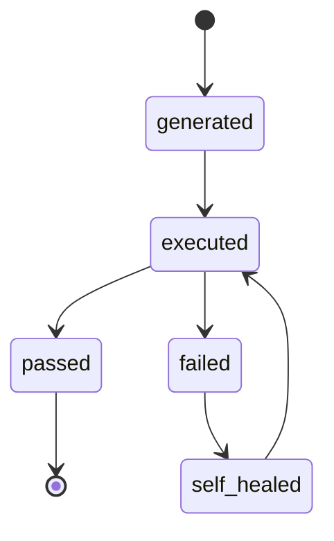
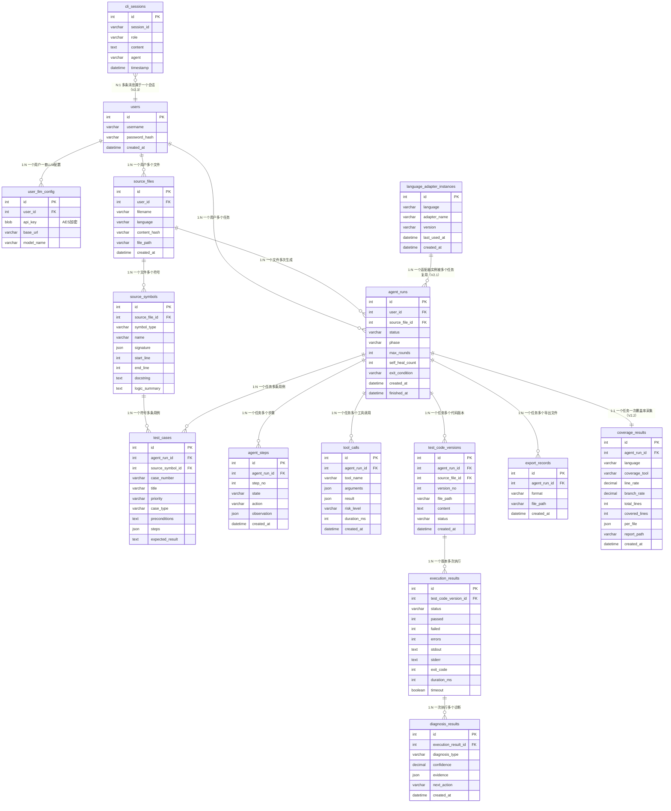
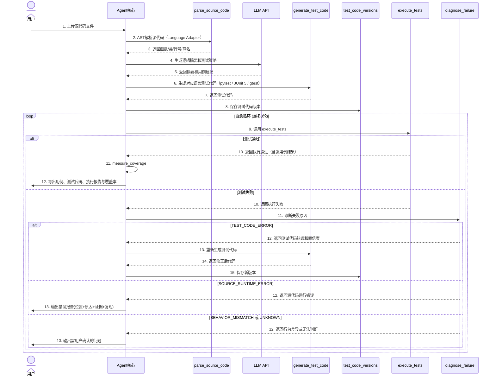

# 测试用例生成Agent — 详细设计文档

> **版本**：V3.1   **日期**：2026-06-11   **状态**：完善稿（已对齐实际实现）
>
> **对应概要设计**：见《概要设计文档》
>
> **覆盖范围**：数据结构、接口签名、诊断逻辑、版本管理、图形附录

***

## 目录

| 章节           | 内容                           |
| ------------ | ---------------------------- |
| 1 数据结构详细设计   | MySQL表结构、Redis存储方案、ER图       |
| 2 诊断判定逻辑     | diagnose\_failure详细判定规则、输出格式 |
| 3 存储方案总结     | 各介质存储策略                      |
| 4 工具接口详细设计   | 核心工具入参、出参、错误约定               |
| 5 核心算法与流程    | AST解析、生成、自愈、质量检查             |
| 6 错误处理与安全校验  | 错误码、护栏、路径与执行约束               |
| 7 Mastra实现设计 | 项目结构、Workflow步骤、Tool桥接协议     |
| 附录A 图形附录     | ER图、自愈循环时序图                  |

***

## 1 数据结构详细设计

> ⚠️ **实现状态说明**：本章为 CLI 版设计阶段的数据表规划。V3.0 Web 版实际落地的数据库结构以 [prisma/schema.prisma](../prisma/schema.prisma) 为唯一真源（共 10 张表：users / api_keys / workspaces / sessions / messages / tasks / task_logs / uploaded_files / file_contents / usage_stats），详见《数据库设计文档》（docs/）。本章规划中的 agent_runs / source_symbols / test_cases 等细粒度表未单独建表，相关数据以 JSON 形式存于 `tasks.result` 与导出报告中。

### 1.1 MySQL业务数据表

#### users（用户账户）

| 字段名            | 类型           | 约束                  | 说明   |
| -------------- | ------------ | ------------------- | ---- |
| id             | int          | PK, AUTO\_INCREMENT | 用户ID |
| username       | varchar(64)  | UNIQUE, NOT NULL    | 用户名  |
| password\_hash | varchar(256) | NOT NULL            | 密码哈希 |
| created\_at    | datetime     | NOT NULL            | 创建时间 |
| updated\_at    | datetime     | NOT NULL            | 更新时间 |

#### user\_llm\_config（用户LLM配置）

| 字段名                 | 类型           | 约束                  | 说明             |
| ------------------- | ------------ | ------------------- | -------------- |
| id                  | int          | PK, AUTO\_INCREMENT | 配置ID           |
| user\_id            | int          | FK → users.id       | 用户ID           |
| api\_key\_encrypted | blob         | NOT NULL            | API Key（AES加密） |
| base\_url           | varchar(256) | NOT NULL            | API地址          |
| model\_name         | varchar(64)  | NOT NULL            | 模型名称           |
| created\_at         | datetime     | NOT NULL            | 创建时间           |

#### source\_files（源代码文件元信息）

| 字段名           | 类型           | 约束                  | 说明   |
| ------------- | ------------ | ------------------- | ---- |
| id            | int          | PK, AUTO\_INCREMENT | 文件ID |
| user\_id      | int          | FK → users.id       | 用户ID |
| filename      | varchar(256) | NOT NULL            | 文件名  |
| language      | varchar(32)  | NOT NULL            | 编程语言 |
| content\_hash | varchar(64)  | NOT NULL            | 内容哈希 |
| file\_path    | varchar(512) | NOT NULL            | 存储路径 |
| created\_at   | datetime     | NOT NULL            | 创建时间 |

#### source\_symbols（AST解析出的函数/类/方法）

| 字段名              | 类型           | 约束                    | 说明                          |
| ---------------- | ------------ | --------------------- | --------------------------- |
| id               | int          | PK, AUTO\_INCREMENT   | 符号ID                        |
| source\_file\_id | int          | FK → source\_files.id | 所属文件                        |
| symbol\_type     | varchar(32)  | NOT NULL              | 符号类型（class/function/method） |
| name             | varchar(128) | NOT NULL              | 符号名称                        |
| signature        | json         | NOT NULL              | 签名（参数列表、类型注解、默认值）           |
| start\_line      | int          | NOT NULL              | 起始行号                        |
| end\_line        | int          | NOT NULL              | 结束行号                        |
| docstring        | text         | NULL                  | 文档注释                        |
| logic\_summary   | text         | NULL                  | LLM生成的逻辑摘要                  |

#### agent\_runs（一次完整生成任务）

| 字段名               | 类型          | 约束                    | 说明                           |
| ----------------- | ----------- | --------------------- | ---------------------------- |
| id                | int         | PK, AUTO\_INCREMENT   | 运行ID                         |
| user\_id          | int         | FK → users.id         | 用户ID                         |
| source\_file\_id  | int         | FK → source\_files.id | 源文件ID                        |
| status            | varchar(32) | NOT NULL              | 任务状态（running/success/failed） |
| phase             | varchar(32) | NOT NULL              | 当前阶段（V1.0/V2.0/V3.0）         |
| max\_rounds       | int         | DEFAULT 20            | 最大轮次                         |
| self\_heal\_count | int         | DEFAULT 0             | 已自愈次数                        |
| exit\_condition   | varchar(64) | NULL                  | 退出条件编码                       |
| created\_at       | datetime    | NOT NULL              | 创建时间                         |
| finished\_at      | datetime    | NULL                  | 完成时间                         |

#### agent\_steps（Agent状态流转记录）

| 字段名            | 类型           | 约束                  | 说明   |
| -------------- | ------------ | ------------------- | ---- |
| id             | int          | PK, AUTO\_INCREMENT | 步骤ID |
| agent\_run\_id | int          | FK → agent\_runs.id | 所属任务 |
| step\_no       | int          | NOT NULL            | 步骤序号 |
| state          | varchar(64)  | NOT NULL            | 状态名称 |
| action         | varchar(128) | NOT NULL            | 执行动作 |
| observation    | json         | NULL                | 观察结果 |
| created\_at    | datetime     | NOT NULL            | 创建时间 |

#### tool\_calls（工具调用审计记录）

| 字段名            | 类型          | 约束                  | 说明   |
| -------------- | ----------- | ------------------- | ---- |
| id             | int         | PK, AUTO\_INCREMENT | 调用ID |
| agent\_run\_id | int         | FK → agent\_runs.id | 所属任务 |
| tool\_name     | varchar(64) | NOT NULL            | 工具名称 |
| arguments      | json        | NOT NULL            | 调用参数 |
| result         | json        | NULL                | 返回结果 |
| risk\_level    | varchar(16) | NOT NULL            | 风险等级 |
| duration\_ms   | int         | NOT NULL            | 执行耗时 |
| created\_at    | datetime    | NOT NULL            | 调用时间 |

#### test\_cases（测试用例）

| 字段名                | 类型           | 约束                      | 说明               |
| ------------------ | ------------ | ----------------------- | ---------------- |
| id                 | int          | PK, AUTO\_INCREMENT     | 用例ID             |
| agent\_run\_id     | int          | FK → agent\_runs.id     | 所属任务             |
| source\_symbol\_id | int          | FK → source\_symbols.id | 关联符号             |
| case\_number       | varchar(32)  | NOT NULL                | 用例编号             |
| title              | varchar(256) | NOT NULL                | 用例标题             |
| priority           | varchar(8)   | NOT NULL                | 优先级（P0/P1/P2/P3） |
| case\_type         | varchar(16)  | NOT NULL                | 用例类型（功能/边界/异常）   |
| preconditions      | text         | NULL                    | 前置条件             |
| steps              | json         | NOT NULL                | 测试步骤             |
| expected\_result   | text         | NOT NULL                | 预期结果             |

#### test\_code\_versions（测试代码版本）

| 字段名              | 类型           | 约束                    | 说明        |
| ---------------- | ------------ | --------------------- | --------- |
| id               | int          | PK, AUTO\_INCREMENT   | 版本ID      |
| agent\_run\_id   | int          | FK → agent\_runs.id   | 所属任务      |
| source\_file\_id | int          | FK → source\_files.id | 源文件ID     |
| version\_no      | int          | NOT NULL              | 版本号（从1递增） |
| file\_path       | varchar(512) | NOT NULL              | 文件路径      |
| content          | text         | NOT NULL              | 代码内容      |
| status           | varchar(32)  | NOT NULL              | 版本状态      |
| created\_at      | datetime     | NOT NULL              | 创建时间      |

#### execution\_results（测试执行结果）

| 字段名                     | 类型          | 约束                           | 说明    |
| ----------------------- | ----------- | ---------------------------- | ----- |
| id                      | int         | PK, AUTO\_INCREMENT          | 执行ID  |
| test\_code\_version\_id | int         | FK → test\_code\_versions.id | 关联版本  |
| status                  | varchar(32) | NOT NULL                     | 执行状态  |
| passed                  | int         | DEFAULT 0                    | 通过用例数 |
| failed                  | int         | DEFAULT 0                    | 失败用例数 |
| errors                  | int         | DEFAULT 0                    | 错误用例数 |
| stdout                  | text        | NULL                         | 标准输出  |
| stderr                  | text        | NULL                         | 标准错误  |
| exit\_code              | int         | NULL                         | 退出码   |
| duration\_ms            | int         | NULL                         | 执行耗时  |
| timeout                 | boolean     | DEFAULT false                | 是否超时  |

#### diagnosis\_results（失败诊断结果）

| 字段名                   | 类型           | 约束                         | 说明                  |
| --------------------- | ------------ | -------------------------- | ------------------- |
| id                    | int          | PK, AUTO\_INCREMENT        | 诊断ID                |
| execution\_result\_id | int          | FK → execution\_results.id | 关联执行结果              |
| diagnosis\_type       | varchar(32)  | NOT NULL                   | 诊断类型                |
| confidence            | decimal(4,3) | NOT NULL                   | 置信度（0.000 \~ 1.000） |
| evidence              | json         | NOT NULL                   | 证据列表                |
| next\_action          | varchar(64)  | NOT NULL                   | 建议动作                |
| created\_at           | datetime     | NOT NULL                   | 创建时间                |

#### export\_records（导出记录）

| 字段名            | 类型           | 约束                  | 说明     |
| -------------- | ------------ | ------------------- | ------ |
| id             | int          | PK, AUTO\_INCREMENT | 导出ID   |
| agent\_run\_id | int          | FK → agent\_runs.id | 所属任务   |
| format         | varchar(16)  | NOT NULL            | 导出格式   |
| file\_path     | varchar(512) | NOT NULL            | 导出文件路径 |
| created\_at    | datetime     | NOT NULL            | 导出时间   |

#### coverage\_results（真实覆盖率结果，V2.2）

| 字段名              | 类型             | 约束                          | 说明                                                       |
| ---------------- | -------------- | --------------------------- | -------------------------------------------------------- |
| id               | int            | PK, AUTO\_INCREMENT         | 覆盖率ID                                                    |
| agent\_run\_id  | int            | FK → agent\_runs.id         | 所属任务                                                     |
| language         | varchar(16)    | NOT NULL                    | python / java / cpp                                        |
| coverage\_tool   | varchar(32)    | NOT NULL                    | coverage.py / JaCoCo / gcov                                 |
| line\_rate       | decimal(6,3)   | NOT NULL                    | 真实行覆盖率（百分比，0.000\~100.000）                                |
| branch\_rate     | decimal(6,3)   | NOT NULL                    | 分支覆盖率（百分比）                                               |
| total\_lines     | int            | NOT NULL                    | 源代码总行数                                                   |
| covered\_lines   | int            | NOT NULL                    | 已覆盖行数                                                    |
| per\_file        | json           | NOT NULL                    | 每文件覆盖率明细（list of {file, line_rate, branch_rate}）         |
| report\_path     | varchar(512)   | NOT NULL                    | 原始报告路径（`.xml` / `.html` / `.json`）                            |
| created\_at      | datetime       | NOT NULL                    | 创建时间                                                     |

#### language\_adapter\_instances（Language Adapter 实例缓存，V2.1）

| 字段名           | 类型           | 约束                    | 说明                              |
| ------------- | ------------ | --------------------- | ------------------------------- |
| id            | int          | PK, AUTO\_INCREMENT  | 缓存ID                            |
| language      | varchar(16)  | NOT NULL              | python / java / cpp              |
| adapter\_name | varchar(64)  | NOT NULL              | python-adapter / java-adapter / cpp-adapter |
| version       | varchar(16)  | NOT NULL              | 适配器版本                           |
| last\_used\_at| datetime     | NOT NULL              | 最近使用时间                          |
| created\_at   | datetime     | NOT NULL              | 创建时间                            |

#### cli\_sessions（CLI 交互式会话消息，V2.3）

| 字段名         | 类型           | 约束                  | 说明            |
| ----------- | ------------ | ------------------- | ------------- |
| id          | int          | PK, AUTO\_INCREMENT | 消息ID          |
| session\_id | varchar(64)  | NOT NULL            | 会话ID          |
| role        | varchar(16)  | NOT NULL            | user / agent  |
| content     | text         | NOT NULL            | 消息内容          |
| agent       | varchar(32)  | NULL                | 来自哪个 agent    |
| timestamp   | datetime     | NOT NULL            | 时间戳           |

### 1.2 数据库关系约束

```
users 1──N user_llm_config     # 一个用户一套LLM配置
users 1──N source_files         # 一个用户多个文件
users 1──N agent_runs           # 一个用户多个任务
source_files 1──N source_symbols    # 一个文件多个符号
source_files 1──N agent_runs        # 一个文件多次生成
source_symbols 1──N test_cases      # 一个符号多条用例
agent_runs 1──N agent_steps         # 一个任务多个步骤
agent_runs 1──N tool_calls          # 一个任务多个工具调用
agent_runs 1──N test_cases          # 一个任务多条用例
agent_runs 1──N test_code_versions  # 一个任务多个代码版本
test_code_versions 1──N execution_results  # 一个版本多次执行
execution_results 1──N diagnosis_results   # 一次执行多个诊断
agent_runs 1──N export_records      # 一个任务多个导出文件
agent_runs 1──N coverage_results    # 一个任务一次覆盖率采集（V2.2）
language_adapter_instances 1──N agent_runs  # 一个适配器实例被多个任务复用（V2.1）
cli_sessions N──1 users               # 多条消息属于一个会话（V2.3）
```

***

## 2 诊断判定逻辑

### 2.1 diagnose\_failure 判定规则

Agent通过pytest执行结果、traceback、AST元信息、生成用例和测试代码版本共同判定失败原因。

**判定优先级**：从上到下依次判断，匹配即停止。

| 优先级 | 诊断类型                   | 判定依据                                                                                  |
| :-: | ---------------------- | ------------------------------------------------------------------------------------- |
|  1  | `SOURCE_RUNTIME_ERROR` | traceback指向源代码文件行号；源代码文件存在语法错误（SyntaxError）；运行时异常（TypeError, ValueError等）发生在源代码而非测试代码 |
|  2  | `TEST_CODE_ERROR`      | traceback指向生成测试文件行号；测试调用了不存在的函数/类；fixture名称未定义；mock路径错误；参数类型或数量不匹配；import路径错误         |
|  3  | `BEHAVIOR_MISMATCH`    | 测试可以正常执行，但实际返回值与docstring/需求文本/用例预期不一致                                                |
|  4  | `UNKNOWN`              | 证据不足，无法可靠判断根因                                                                         |

### 2.2 诊断输出格式

```json
{
  "diagnosis_type": "TEST_CODE_ERROR",
  "confidence": 0.82,
  "evidence": [
    "traceback points to generated test file at line 23",
    "fixture name 'mock_db_session' is undefined in conftest",
    "generated test calls function 'get_user()' but source defines 'fetch_user()'"
  ],
  "next_action": "REGENERATE_TEST_CODE"
}
```

### 2.3 诊断类型与Agent行为

| 诊断类型                   | Agent行为                     | 复现命令                                          |
| ---------------------- | --------------------------- | --------------------------------------------- |
| `TEST_CODE_ERROR`      | 进入自愈循环，重新生成测试代码，最多重试 3 轮    | Python `pytest -q <file> -k <name>`；Java `mvn -q -Dtest=<ClassName>#<testName> test`；C++ `./<gtest_exe> --gtest_filter=<Suite>.<Test>` |
| `SOURCE_RUNTIME_ERROR` | 输出错误报告：位置+原因+证据+按语言分写的复现步骤，不修改源代码 | 同上                                            |
| `BEHAVIOR_MISMATCH`    | 输出实际结果与预期结果的差异，说明预期来源，不自动修改 | 同上                                            |
| `UNKNOWN`              | 输出诊断证据和建议，不进入自愈循环           | 同上                                            |

### 2.4 自愈阈值

| 条件                                                        | 自愈阈值          | 行为          |
| --------------------------------------------------------- | ------------- | ----------- |
| `diagnosis_type = TEST_CODE_ERROR` 且 `confidence >= 0.70` | 自动重生成测试代码     | 进入自愈循环      |
| `diagnosis_type = TEST_CODE_ERROR` 但 `confidence < 0.70`  | 输出诊断结果和低置信度警告 | 停止自动修改，报告用户 |
| 其他诊断类型                                                    | 不自愈           | 按对应类型逻辑处理   |

### 2.5 版本管理策略

**版本号规则**：从1开始递增，每轮自愈重生成 +1。

**版本状态**：

| 状态            | 说明      |
| ------------- | ------- |
| `generated`   | 初始生成    |
| `self_healed` | 自愈后重新生成 |
| `executed`    | 已执行     |
| `passed`      | 执行通过    |
| `failed`      | 执行失败    |

**版本保留策略**：所有版本均保留，不覆盖、不删除，支持回溯查看任一轮次的代码和执行结果。

***

## 3 存储方案总结

| 存储介质     | 数据类别                         | 保留时间 | 访问模式  | 所属阶段  |
| -------- | ---------------------------- | ---- | ----- | ----- |
| 文件系统     | 源代码文件、测试代码文件、导出文件            | 可配置  | 按路径读写 | V1.0起 |
| JSON运行记录 | V1.0阶段的任务结果、执行结果和导出索引        | 可配置  | 本地读写  | V1.0  |
| InMemoryStore | 会话期中间结果（解析中间产物、覆盖率原始报告、自愈诊断上下文） | 进程级  | 进程内高频 | V2.0起 |
| Redis    | 运行中消息、循环状态、工具调用中间结果          | 24小时 | 高频读写  | V3.0  |
| MySQL    | 用户、配置、源代码、符号、用例、版本、执行结果、诊断结果、覆盖率结果、Language Adapter 实例、CLI 会话消息 | 永久   | 低频读写  | V3.0  |

### 3.1 V1.0 文件系统目录结构

```
output/
├── sources/                # 用户源代码
│   ├── {file_hash}.py
│   └── ...
├── tests/                  # 生成测试代码
│   ├── test_{filename}/
│   │   ├── v001_test_{filename}.py
│   │   ├── v002_test_{filename}.py   # 自愈后版本
│   │   └── ...
│   └── ...
├── reports/                # 执行结果报告
│   ├── {run_id}_result.json
│   └── ...
└── exports/                # 导出文件（按语言/任务名分目录）
    ├── testpy/
    │   ├── test_generated.py
    │   └── test_cases.md
    ├── testjava1/
    │   ├── TestSourceSmallTest.java
    │   └── test_cases.md
    └── testcpp1/
        ├── test_source_small.cpp
        └── test_cases.md
```

***

## 4 工具接口详细设计

> ⚠️ **实现状态说明**：本章为设计阶段的工具接口规划。实际实现中，确定性工具共 7 个（read-file / write-file / parse-source-code / execute-tests / coverage / export-cases / logger，见 `src/mastra/tools/`）；其中 4.4 `summarize_code_logic`、4.5 `generate_test_cases` 的能力由 `testCaseAgent` 承担，4.6 `generate_test_code` 由 `testCodeAgent`/`testCodeAgentPro` 承担，4.8 `diagnose_failure` 由 `diagnosisAgent` 系列承担，4.9 `create_test_code_version` 在工作流内部以 `versions[]` 数组实现——这些不再是独立注册的 Mastra Tool，但其输入输出契约仍如本章所述。

### 4.1 工具返回通用结构

所有工具以Mastra Tool形式注册，使用TypeScript和Schema定义输入输出。工具返回值使用统一包裹结构，便于Mastra Agent/Workflow处理成功、失败、最终结果和审计日志。

```json
{
  "ok": true,
  "data": {},
  "error": null,
  "__final__": false,
  "metadata": {
    "duration_ms": 120,
    "risk_level": "low",
    "runtime": "typescript"
  }
}
```

错误返回格式如下：

```json
{
  "ok": false,
  "data": null,
  "error": {
    "code": "PARSE_SYNTAX_ERROR",
    "message": "invalid syntax at line 12",
    "details": {
      "line": 12,
      "offset": 8
    }
  },
  "__final__": false,
  "metadata": {
    "duration_ms": 34,
    "risk_level": "low",
    "runtime": "python"
  }
}
```

Mastra Tool注册时至少包含以下信息：

| 字段              | 说明                                      |
| --------------- | --------------------------------------- |
| id              | 工具唯一标识，例如 `parse-source-code`           |
| description     | 给LLM判断何时调用工具的简短说明                       |
| inputSchema     | Zod或Standard JSON Schema形式的入参定义         |
| outputSchema    | Zod或Standard JSON Schema形式的出参定义         |
| requireApproval | 是否需要人工审批，高风险工具设为true                    |
| execute         | TypeScript执行函数，可直接执行逻辑或调用Python Runtime |

### 4.2 read\_file

| 项目   | 说明                       |
| ---- | ------------------------ |
| 风险等级 | 低                        |
| 所属阶段 | V1.0                     |
| 功能   | 读取Python源文件或粘贴代码落盘后的临时文件 |

**输入：**

```json
{
  "path": "src/user_service.py",
  "encoding": "utf-8"
}
```

**输出：**

```json
{
  "path": "src/user_service.py",
  "filename": "user_service.py",
  "content": "def register_user(...): ...",
  "content_hash": "sha256...",
  "line_count": 120
}
```

### 4.3 parse\_source\_code

| 项目   | 说明                  |
| ---- | ------------------- |
| 风险等级 | 低                   |
| 所属阶段 | V1.0                |
| 功能   | 使用Python AST提取源文件结构 |

**输入：**

```json
{
  "filename": "user_service.py",
  "content": "def register_user(...): ..."
}
```

**输出字段：**

| 字段           | 类型     | 说明            |
| ------------ | ------ | ------------- |
| module\_name | string | 模块名           |
| imports      | array  | import语句列表    |
| classes      | array  | 类定义列表         |
| functions    | array  | 顶层函数列表        |
| warnings     | array  | 文件过大、无可测函数等提示 |

### 4.4 summarize\_code\_logic

| 项目   | 说明                       |
| ---- | ------------------------ |
| 风险等级 | 低                        |
| 所属阶段 | V1.0                     |
| 功能   | 调用LLM为符号生成逻辑摘要、输入约束、分支说明 |

**输入：**

```json
{
  "symbol": {
    "name": "register_user",
    "signature": {"params": ["phone", "nickname", "password", "code"]},
    "docstring": "注册用户，成功返回True"
  },
  "source_excerpt": "def register_user(...): ..."
}
```

**输出：**

```json
{
  "logic_summary": "校验手机号、密码和验证码，成功后写入用户记录",
  "input_constraints": ["phone must be 11 digits", "password length 8-16"],
  "branches": ["success", "duplicate phone", "invalid password"],
  "test_focus": ["normal path", "boundary values", "invalid inputs"]
}
```

### 4.5 generate\_test\_cases

| 项目   | 说明         |
| ---- | ---------- |
| 风险等级 | 低          |
| 所属阶段 | V1.0       |
| 功能   | 生成标准测试用例列表 |

**输入：**

```json
{
  "symbols": [],
  "logic_summaries": [],
  "requirements_text": ""
}
```

**输出：**

```json
{
  "cases": [
    {
      "case_number": "TC-001",
      "title": "正常注册流程验证",
      "priority": "P0",
      "case_type": "功能",
      "preconditions": "手机号未注册",
      "steps": ["调用register_user"],
      "expected_result": "返回True",
      "related_symbol": "register_user"
    }
  ]
}
```

### 4.6 generate\_test\_code

| 项目   | 说明               |
| ---- | ---------------- |
| 风险等级 | 低                |
| 所属阶段 | V1.0             |
| 功能   | 根据用例生成pytest测试代码 |

**输入：**

```json
{
  "source_file": "user_service.py",
  "module_name": "user_service",
  "cases": [],
  "previous_failure": null
}
```

**输出：**

```json
{
  "test_filename": "test_user_service.py",
  "content": "import pytest\nfrom user_service import register_user\n..."
}
```

### 4.7 execute\_tests

| 项目   | 说明                 |
| ---- | ------------------ |
| 风险等级 | 中                  |
| 所属阶段 | V1.0 / V2.1       |
| 功能   | 按语言分发到 Language Adapter（python-adapter / java-adapter / cpp-adapter）执行测试并采集结果 |

**输入：**

```json
{
  "source_file_path": "output/sources/hash.py",
  "test_file_path": "output/tests/test_hash/v001_test_hash.py",
  "language": "python",
  "timeout_seconds": 60
}
```

**输出：**

```json
{
  "language": "python",
  "status": "failed",
  "passed": 4,
  "failed": 1,
  "errors": 0,
  "stdout": "...",
  "stderr": "...",
  "exit_code": 1,
  "duration_ms": 1432,
  "timeout": false,
  "command": "pytest -q test_hash.py",
  "test_results": [
    {
      "test_class": "TestHash",
      "test_name": "test_hash_returns_correct_value",
      "result": "passed",
      "duration_ms": 12,
      "failure_reason": ""
    }
  ]
}
```

### 4.8 diagnose\_failure

| 项目   | 说明                |
| ---- | ----------------- |
| 风险等级 | 低                 |
| 所属阶段 | V2.0 / V2.1      |
| 功能   | 按语言对失败结果进行根因分类，复现命令按语言分写 |

**输入：**

```json
{
  "execution_result": {},
  "source_symbols": [],
  "test_code_version": {},
  "test_cases": []
}
```

**输出：**

```json
{
  "diagnosis_type": "TEST_CODE_ERROR",
  "confidence": 0.82,
  "evidence": ["traceback points to generated test file"],
  "next_action": "REGENERATE_TEST_CODE"
}
```

### 4.9 create\_test\_code\_version

| 项目   | 说明               |
| ---- | ---------------- |
| 风险等级 | 中                |
| 所属阶段 | V2.0             |
| 功能   | 保存测试代码版本，版本号从1递增 |

**输入：**

```json
{
  "agent_run_id": 1001,
  "source_file_id": 2001,
  "content": "def test_x(): ...",
  "status": "generated"
}
```

**输出：**

```json
{
  "version_no": 1,
  "file_path": "output/tests/test_user_service/v001_test_user_service.py",
  "status": "generated"
}
```

### 4.10 measure\_coverage

| 项目   | 说明                                       |
| ---- | ---------------------------------------- |
| 风险等级 | 中                                        |
| 所属阶段 | V2.2                                     |
| 功能   | 按语言采集真实行/分支覆盖率（Python coverage.py / Java JaCoCo / C++ gcov） |

**输入：**

```json
{
  "agent_run_id": 1001,
  "language": "java",
  "source_file_path": "...",
  "execution_result": { "cwd": "D:/Temp/testgenerate-java-XXX", "command": "mvn verify ..." }
}
```

**输出：**

```json
{
  "language": "java",
  "coverage_tool": "JaCoCo",
  "line_rate": 88.89,
  "branch_rate": 100.0,
  "total_lines": 9,
  "covered_lines": 8,
  "per_file": [
    { "file": "TestSourceSmall.java", "line_rate": 88.89, "branch_rate": 100.0 }
  ],
  "report_path": "D:/Temp/testgenerate-java-XXX/target/site/jacoco/jacoco.xml"
}
```

### 4.11 export\_cases

`check_quality` 工具下线，断言质量由 LLM 在生成阶段直接把关（生成 prompt 中要求"禁止空断言/恒真断言/无验证执行"，恒真断言识别覆盖 pytest `assert True`、JUnit 5 `assertTrue(true)`、GoogleTest `ASSERT_TRUE(true)` / `EXPECT_TRUE(true)`）。`export_cases` 负责导出 Markdown 文档（`.md`）和对应语言的测试代码文件（`.py` / `.java` / `.cpp`），按语言分发到 `python-adapter` / `java-adapter` / `cpp-adapter` 的 `exportArtifacts` 实现。导出目录约定：`output/exports/{testpy*,testjava*,testcpp*}/`。返回结构化结果与所有生成文件路径。

***

## 5 核心算法与流程

### 5.1 AST解析算法

**Python（`python-runtime/parse_source.py`，标准库 `ast`）：**

1. 使用 `ast.parse` 将源码解析为AST。
2. 遍历 `Import`、`ImportFrom` 节点，收集依赖信息。
3. 遍历 `ClassDef`、`FunctionDef`、`AsyncFunctionDef` 节点，提取名称、docstring、参数、默认值、返回注解、起止行号。
4. 对类内函数标记为method，对顶层函数标记为function。
5. 若解析失败，返回 `PARSE_SYNTAX_ERROR`，并携带行号、列号和错误文本。
6. 若未发现可测试符号，返回空结构和warning，不进入测试代码生成。

**Java / C++（`parse-source-code-tool.ts`，tree-sitter）：**

1. 使用 `tree-sitter-java` / `tree-sitter-cpp` 将源码解析为语法树。
2. 遍历类声明、方法/函数声明节点，提取名称、参数（名称+类型+原始文本）、返回类型、起止行号、文档注释。
3. Java 额外记录注解与 modifier；C++ 额外处理类外定义（`ClassName::method`）与 namespace。
4. 解析异常时返回 warnings 并降级为空符号列表，不中断流程。

### 5.2 测试用例生成策略

| 策略     | 说明                                          |
| ------ | ------------------------------------------- |
| 功能测试   | 覆盖正常流程、主要分支和典型业务路径                          |
| 边界测试   | 对数字、字符串、集合、空值、长度和格式约束做边界值分析                 |
| 异常测试   | 覆盖非法类型、无效格式、缺失依赖、重复数据等异常路径                  |
| 行为来源标记 | 预期结果需标记来源：需求文本、docstring、函数名推断、代码逻辑推断或LLM推断 |
| 最低数量   | 每个目标函数至少生成3条用例，覆盖功能、边界、异常中的至少2类             |

### 5.3 自愈循环算法

```text
self_heal_count = 0
round_no = 0

while round_no < 20:
    round_no += 1
    generate_or_regenerate_test_code()
    create_test_code_version()
    result = execute_tests()

    if result.passed_all:
        coverage = measure_coverage()        # V2.0 起的质量信号
        export_cases(coverage=coverage)
        return FINISHED

    diagnosis = diagnose_failure(result)
    if diagnosis.type == TEST_CODE_ERROR and diagnosis.confidence >= 0.70 and self_heal_count < 3:
        self_heal_count += 1
        continue

    return report_to_user(diagnosis)

return report_max_rounds_exceeded()
```

### 5.4 质量约束

V2.0 起 `check_quality` 工具下线，相关规则改为由 LLM 在 `generate_test_code` 阶段的内嵌 prompt 约束，规则要点保留如下：

| 约束编号  | 检查项                 | 不合格示例                                     |
| ----- | ------------------- | ----------------------------------------- |
| QA-01 | 禁止无断言测试             | 只调用函数但没有assert                            |
| QA-02 | 禁止恒真断言              | `assert True`、`assert 1 == 1`             |
| QA-03 | 禁止只检查非空而忽略核心结果      | 对明确返回布尔值的函数只写 `assert result is not None` |
| QA-04 | 异常用例必须验证异常或错误返回     | 只执行非法输入但不检查异常或返回值                         |
| QA-05 | mock/fixture必须有定义来源 | 使用未定义fixture或错误mock路径                     |

覆盖率作为补充质量信号，详见 `measure_coverage` 工具。

### 5.5 版本状态流转



版本不覆盖、不删除。自愈重生成时创建新版本；执行结果和诊断结果关联到对应版本，便于回溯每一次失败证据和修复依据。

***

## 6 错误处理与安全校验

### 6.1 错误码定义

| 错误码                     | 场景               | 处理方式            |
| ----------------------- | ---------------- | --------------- |
| `FILE_NOT_FOUND`        | 输入文件不存在          | 终止任务，提示检查路径     |
| `FILE_TYPE_UNSUPPORTED` | 输入或输出格式不在允许列表    | 终止当前工具调用        |
| `PATH_OUT_OF_SCOPE`     | 路径越过允许目录         | 拒绝执行并记录安全事件     |
| `PARSE_SYNTAX_ERROR`    | 源代码语法错误          | 返回行号、列号和错误文本    |
| `NO_TESTABLE_SYMBOL`    | 未发现函数、类或方法       | 返回提示，不生成测试代码    |
| `LLM_TIMEOUT`           | 模型调用超时           | 可重试；多次失败后终止     |
| `LLM_INVALID_RESPONSE`  | LLM返回非结构化或缺少必要字段 | 要求重试或转为错误报告     |
| `PYTEST_TIMEOUT`        | pytest执行超过限制     | 终止子进程并记录timeout |
| `PYTEST_COLLECT_ERROR`  | pytest收集失败       | 进入诊断流程          |
| `MAVEN_NOT_AVAILABLE`   | Java 适配器找不到 mvn | 提示安装或配置 MAVEN_HOME |
| `GTEST_BUILD_FAILED`    | C++ 测试编译失败      | 进入诊断流程          |
| `COVERAGE_NOT_AVAILABLE` | 覆盖率工具不可用（coverage.py / JaCoCo / gcov） | 报告中以"工具不可用"标注，跳过覆盖率项 |
| `EXPORT_FAILED`         | 导出文件失败           | 返回已生成结果和失败格式    |

### 6.2 路径安全校验

路径校验按以下顺序执行：

1. 将输入路径转换为绝对路径。
2. 解析符号链接或相对路径片段。
3. 判断最终路径是否位于允许的输入目录、临时目录或输出目录内。
4. 检查扩展名是否符合当前工具允许列表。
5. 对写入操作检查目标文件是否会覆盖非本次任务生成文件。

### 6.3 执行安全校验

V1.0使用临时目录和subprocess执行测试，默认超时60秒（Python 仍为 60s；Java/C++ 走 `Language Adapter`，默认 180s，留出首次冷启动下载依赖/编译的余量）。执行前将源文件和测试文件复制到临时目录，避免测试代码直接操作原始输入文件。V1.0不承诺强网络隔离和CPU/内存隔离；若面向不可信用户开放，必须升级为容器化执行环境。

### 6.4 日志与审计

| 日志对象               | 记录内容                                                 |
| ------------------ | ---------------------------------------------------- |
| agent\_steps       | step\_no、state、action、observation                    |
| tool\_calls        | tool\_name、arguments、result、risk\_level、duration\_ms |
| execution\_results | language、status、passed、failed、errors、stdout、stderr、exit\_code、duration\_ms、timeout、test\_results |
| diagnosis\_results | diagnosis\_type、confidence、evidence、next\_action     |
| coverage\_results  | language、coverage\_tool、line\_rate、branch\_rate、per\_file、report\_path |
| cli\_sessions      | session\_id、role、content、agent、timestamp             |

日志中不得明文记录用户API Key、Token或其他敏感凭证。错误信息需要保留足够定位问题的证据，但应避免泄露系统外部路径和敏感配置。

***

## 7 Mastra实现设计

### 7.1 实际项目结构

```text
testgenerate-agent/
├── package.json
├── tsconfig.json / tsconfig.server.json
├── prisma/
│   └── schema.prisma            # 数据库模型（V3.0）
├── src/
│   ├── cli.ts                   # CLI 入口（命令行 / 交互 / 自主三种模式）
│   ├── tree-sitter.d.ts
│   ├── autonomous/              # 自主 Agent 模式（V3.1）
│   │   ├── autonomous-agent.ts
│   │   ├── autonomous-loop.ts
│   │   ├── approval.ts
│   │   ├── safety.ts
│   │   ├── shell-runner.ts
│   │   ├── ask-user-tool.ts
│   │   └── types.ts / index.ts
│   ├── mastra/
│   │   ├── index.ts
│   │   ├── agents/
│   │   │   ├── test-case-agent.ts
│   │   │   ├── test-code-agent.ts
│   │   │   ├── diagnosis-agent.ts
│   │   │   └── cli-conversation-agent.ts
│   │   ├── workflows/
│   │   │   └── generate-test-workflow.ts
│   │   ├── tools/
│   │   │   ├── read-file-tool.ts
│   │   │   ├── write-file-tool.ts
│   │   │   ├── parse-source-code-tool.ts
│   │   │   ├── execute-tests-tool.ts
│   │   │   ├── coverage-tool.ts
│   │   │   ├── export-cases-tool.ts
│   │   │   └── logger-tool.ts
│   │   ├── languages/
│   │   │   ├── types.ts
│   │   │   ├── registry.ts
│   │   │   ├── python-adapter.ts
│   │   │   ├── java-adapter.ts
│   │   │   └── cpp-adapter.ts
│   │   ├── runtime/
│   │   │   ├── python-bridge.ts
│   │   │   ├── cli-output.ts
│   │   │   ├── command-runner.ts
│   │   │   ├── logger.ts
│   │   │   └── env.ts
│   │   └── memory/
│   │       ├── in-memory-store.ts
│   │       └── session-state.ts
│   └── server/                  # Web 后端（V3.0，Express + Prisma）
│       ├── index.ts / app.ts
│       ├── config/
│       ├── controllers/
│       ├── services/
│       ├── routes/
│       ├── middleware/
│       └── utils/
├── client/                      # Web 前端（V3.0，React + Vite + Antd）
├── python-runtime/
│   ├── parse_source.py
│   ├── run_pytest.py
│   ├── coverage_runner.py
│   ├── export_cases.py
│   └── requirements.txt
├── output/
│   ├── sources/
│   ├── tests/
│   ├── reports/
│   ├── logs/
│   └── exports/
│       ├── testpy/
│       ├── testjava1/
│       └── testcpp1/
├── doc/                         # CLI 版设计文档
└── docs/                        # Web 版文档 + init-database.sql
```

> 注：原规划中的 `create-version-tool.ts` 未单独实现，版本管理在工作流内部以 `versions[]` 数组完成；新增 `logger-tool.ts` 负责运行日志写入。

### 7.2 Mastra Workflow步骤映射

实际工作流（`generate-test-workflow.ts`）由 7 个 Step 链式组成：

| Workflow Step（实际 ID）   | 对应工具/Agent                       | 输入                   | 输出                     |
| --------------------- | -------------------------------- | -------------------- | ---------------------- |
| `read-parse-source`   | `read-file` + `parse-source-code` Tool（ast / tree-sitter） | 输入路径、语言              | 源码内容、AST结构、符号列表、warnings |
| `design-test-cases`   | `testCaseAgent`                  | AST、逻辑摘要、需求文本        | 测试用例列表（含逻辑摘要、输入约束、分支）  |
| `export-cases-plan`   | `export_cases` Tool              | 用例列表                 | 测试计划文档路径               |
| `generate-test-code`  | `testCodeAgent`（自愈时 `testCodeAgentPro`） | 用例、模块名、历史失败信息        | 对应语言测试代码（pytest / JUnit 5 / gtest）+ 版本记录 |
| `execute-tests`       | `execute_tests` Tool → Language Adapter | 源文件、测试文件、timeout、语言     | `ExecutionResult`（含 `test_results` 逐用例列表） |
| `self-healing`        | `diagnosisAgent(Pro)` + `diagnosisDecisionAgent` + `testCodeAgentPro` + `coverage` Tool | 执行结果、traceback、版本、用例 | 诊断、重生成代码、重执行结果、覆盖率     |
| `export-results`      | `export_cases` Tool              | 用例、代码、执行结果、诊断结果、覆盖率 | 导出文件路径（按语言分目录）        |

> 说明：原规划的 `summarize-logic` / `generate-cases` 合并为 `design-test-cases` 一步（由 `testCaseAgent` 一次完成）；`create-version` 不再是独立 Step，版本在 `generate-test-code` 与自愈循环内部记录；`check-quality` 步骤下线，对应的断言质量由 LLM 在生成阶段内嵌 prompt 约束；覆盖率采集在 `self-healing` 步骤内测试通过后调用。`execute-tests` 由 `Language Adapter` 统一接口分发到 python-adapter / java-adapter / cpp-adapter，产物结构一致。

### 7.3 Mastra Agent划分

实际定义 7 个 Agent（`src/mastra/agents/`），按快慢双通道设计（flash 首生成、pro 自愈重试）：

| Agent                    | 模型                   | 职责                          |
| ------------------------ | -------------------- | --------------------------- |
| `testCaseAgent`          | deepseek-v4-flash    | 生成逻辑摘要、输入约束、测试用例            |
| `testCodeAgent`          | deepseek-v4-flash    | 首次生成对应语言的测试代码（pytest / JUnit 5 / gtest） |
| `testCodeAgentPro`       | deepseek-v4-pro      | 自愈重试时高精度重写测试代码              |
| `diagnosisAgent`         | deepseek-v4-flash    | 诊断测试失败根因，输出自然语言诊断           |
| `diagnosisAgentPro`      | deepseek-v4-pro      | 自愈重试时的高精度诊断                 |
| `diagnosisDecisionAgent` | deepseek-v4-flash    | 将自然语言诊断转为结构化决策（JSON，含 next_action） |
| `cliAgent`               | deepseek-v4-flash    | 在 CLI 入口承接用户自由输入的指令（重新生成/调整覆盖率/调整诊断等），输出结构化决策 |

主流程不完全交给单个Agent自由循环，而是由Mastra Workflow控制。Agent只在需要LLM判断的步骤中被调用，降低不可控循环风险。自主 Agent 模式（V3.1，`src/autonomous/`）是例外：该模式下 LLM 作为决策大脑多轮调用工具，由人工审批机制兜底。

### 7.4 Python Runtime桥接协议

TypeScript 侧通过统一桥接函数调用 Python 脚本。输入 JSON 通过 stdin 传入，Python 脚本只在 stdout 输出 JSON 结果，日志和调试信息输出到 stderr，避免污染结构化返回。

**TypeScript 调用约定：**

```ts
type PythonBridgeRequest = {
  script: 'parse_source.py' | 'run_pytest.py' | 'coverage_runner.py' | 'export_cases.py'
  payload: Record<string, unknown>
  timeoutMs: number
}
```

外部 CLI 调度（V2.1 起）通过 `command-runner` 模块完成，统一封装 `mvn verify` / `g++` / `gcov` / `JaCoCo` 等外部命令，强制执行超时、路径白名单、风险评级、stdout/stderr 缓冲，返回 `{ status, exitCode, stdout, stderr, durationMs }` 结构。

**Python返回约定：**

```json
{
  "ok": true,
  "data": {},
  "error": null
}
```

若Python进程退出码非0、stdout不是合法JSON、执行超时或stderr包含致命错误，桥接层转换为统一错误码，例如 `PYTHON_RUNTIME_ERROR`、`PYTHON_BRIDGE_INVALID_JSON`、`PYTHON_BRIDGE_TIMEOUT`。

### 7.5 Mastra Tool示例结构

以下为工具结构示意，具体代码以实现阶段为准：

```ts
export const parseSourceCodeTool = createTool({
  id: 'parse-source-code',
  description: 'Parse Python source code with Python ast and return symbols.',
  inputSchema: parseSourceInputSchema,
  outputSchema: parseSourceOutputSchema,
  execute: async inputData => {
    return runPythonTool({
      script: 'parse_source.py',
      payload: inputData,
      timeoutMs: 10000,
    })
  },
})
```

### 7.6 自愈循环在Mastra中的实现约束

自愈循环由Workflow状态控制，不由LLM自行决定无限重试。Workflow状态至少包含 `roundNo`、`selfHealCount`、`latestVersionNo`、`lastDiagnosis`、`exitCondition`。当 `diagnosis_type = TEST_CODE_ERROR` 且 `confidence >= 0.70` 且 `selfHealCount < 3` 时，Workflow回到 `generate-code` 步骤；否则进入报告或导出步骤。

### 7.7 Guardrails与Approval使用

| 场景         | Mastra能力                       | 处理方式                            |
| ---------- | ------------------------------ | ------------------------------- |
| 用户输入包含提示注入 | Guardrails / input processor   | 标准化、检测、重写或阻断                    |
| 高风险删除或覆盖操作 | Agent Approval / Tool Approval | 暂停工具调用，等待人工确认                   |
| LLM输出非结构化  | output schema校验                | 要求重试或转换为 `LLM_INVALID_RESPONSE` |
| 工具长时间运行    | Workflow错误处理和超时                | 标记失败、记录step错误、进入诊断或退出           |

### 7.8 Mastra能力边界

Mastra不替代 Python 执行沙箱，不直接保证 `pytest` / `mvn verify` / `g++` 运行的网络隔离、CPU 限制或内存限制。执行安全由 `command-runner`（统一超时、路径白名单、风险评级、stdout/stderr 缓冲）调度外部 CLI 强制；临时目录与路径白名单由 `command-runner` 负责。`cli-output` 模块封装 CLI 端显式输出 API（`logAgent` / `logInfo` / `logWarn` / `logError` / `progress bar`），自动适配 TTY/NO_COLOR/CI，不依赖全局 `console.log` 替换。Mastra Memory 可用于对话历史和偏好保存，但业务历史记录仍以本设计中的 MySQL/JSON/InMemoryStore 数据结构为准。

***

## 附录A 图形附录

### A.1 数据库 ER 图



> 图A-1：数据库 ER 图

### A.2 Agent 自愈循环时序图



> 图A-2：Agent 自愈循环时序图
