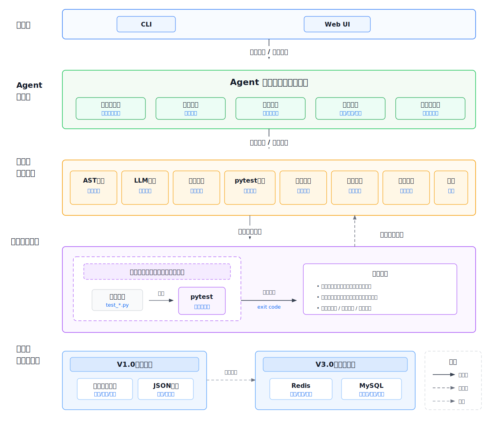
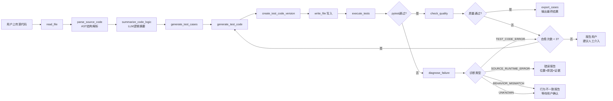
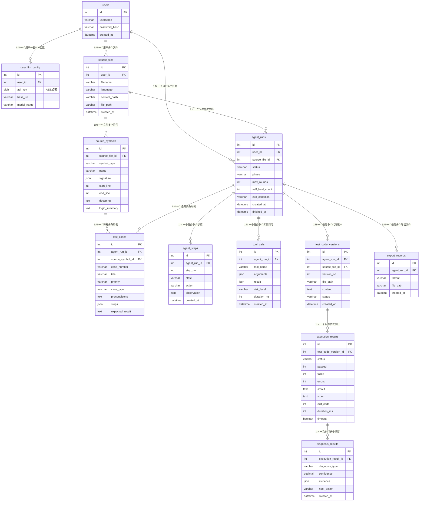
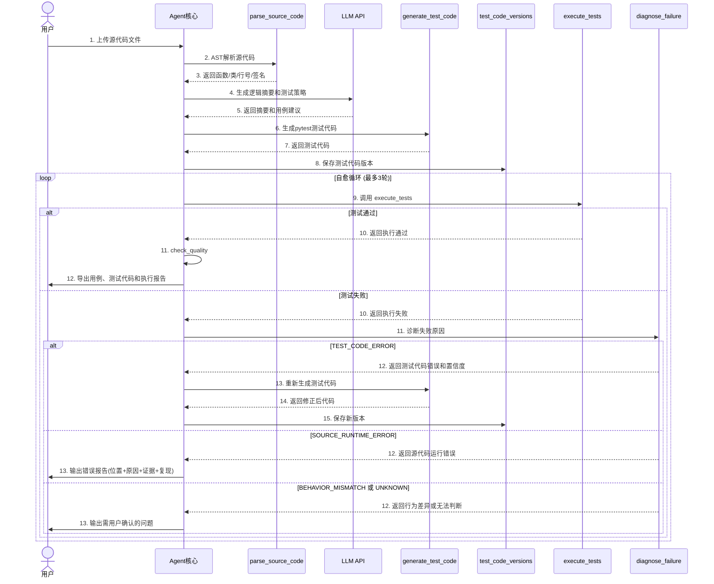

# 测试用例生成Agent — 需求规格说明书 V2.0

> **版本**：V3.0   **日期**：2026-06-10   **状态**：完善稿
>
> **项目性质**：个人独立开发项目   **目标形态**：Web应用 + CLI工具
>
> **核心范式**：LLM + 工具集 + 自主调用机制的智能体架构
>
> **产品阶段规划**：按 V1.0、V2.0、V3.0 三个阶段实现"生成测试用例文档 + 生成 pytest 测试代码 + 自动执行测试 + 失败诊断 + 自愈循环 + 历史持久化"

> 📌 **实现状态注记（2026-06-11）**：本文档为需求阶段的历史记录。截至 V3.1，V1.0~V3.0 规划已全部实现并有以下偏差：① `check_quality` 独立工具未实现，断言质量由 LLM 生成阶段 prompt 内嵌约束替代；② Java/C++ 解析采用 tree-sitter（非正则）；③ Web 版数据库以 `prisma/schema.prisma` 为准（Redis 未引入）；④ 新增自主 Agent REPL 模式（`--autonomous`）。当前实现详见《概要设计文档》《详细设计文档》与 README。

***

## 目录

| 章节           | 内容                               |
| ------------ | -------------------------------- |
| 1 项目概述       | 背景、定位、阶段规划、术语、V2.0升级说明           |
| 2 Agent 系统架构 | LLM + Tools + 自主调用               |
| 3 核心工具集定义    | 工具清单、阶段归属、风险等级                   |
| 4 Agent 运行机制 | 循环机制、退出条件、自愈循环                   |
| 5 安全防护体系     | 多层防护、风险评估、护栏机制                   |
| 6 功能需求       | 输入、账户、解析、生成、执行、自愈                |
| 7 数据结构详细设计   | Agent运行态、代码版本、诊断结果、Redis/MySQL存储 |
| 8 技术选型与实现约束  | Mastra框架、TypeScript/Python双语言架构  |
| 9 约束与假设      | 限制条件与前置假设                        |
| 10 验收标准      | 怎样算做完了                           |
| 11 需求追踪矩阵    | 需求、阶段、验收项对应关系                    |
| 附录A 图形附录     | 架构图、ER图、时序图                      |

***

## 1 项目概述

### 1.1 项目背景

在软件开发生命周期中，测试用例设计和测试代码编写是保障软件质量的核心环节。然而，传统的人工方式面临四大痛点：\
（1）效率低下，开发工程师需逐条分析代码逻辑并手工编写测试用例和测试代码，耗时巨大；\
（2）质量参差，不同工程师编写的测试用例粒度和测试代码覆盖率存在显著差异；\
（3）维护困难，代码频繁变更时测试代码更新滞后；\
（4）调试低效，测试失败时需要人工排查是源代码Bug还是测试代码自身的问题。

为应对上述挑战，本系统研发一款基于大语言模型（LLM）的智能测试用例生成Agent。V2.0在V1.0基础上实现重大升级；不仅生成测试用例描述文档，更能直接生成可执行的 Python pytest 单元测试代码，自动运行测试并分析执行结果。当测试失败时，系统输出带置信度和证据的失败诊断，并在确认属于测试代码问题时进入自愈循环。

### 1.2 项目定位

本项目实现的是一个具备自主决策能力的智能体（Agent），核心差异化特征：

1. **自主决策**：Agent根据输入内容和当前上下文，自主规划执行路径
2. **工具调用**：Agent通过调用预定义的工具集API完成具体操作，LLM负责决策"何时调用哪个工具"
3. **动态工作流**：每次执行路径可能不同，取决于源代码复杂度和测试结果
4. **循环运行与自愈**：Agent在循环中持续运行。测试失败时输出结构化诊断；测试代码错误则自动重生成并再次执行，源代码运行错误或行为不一致则向用户报告证据并等待确认

### 1.3 阶段规划

本项目范围收敛为三个可落地版本：

| 阶段   | 实现范围                              | 交付重点                 |
| ---- | --------------------------------- | -------------------- |
| V1.0 | Python 单文件、AST 解析、pytest 生成、执行、导出 | 先跑通从代码输入到测试文件输出的最短闭环 |
| V2.0 | 失败诊断、自愈循环、测试代码版本管理                | 处理执行失败，记录每轮生成版本和诊断证据 |
| V3.0 | Web 账户、历史记录、数据库持久化                | 支持多用户、历史任务查询、结果长期保存  |

各阶段之间存在依赖关系：V2.0 依赖 V1.0 的执行能力，V3.0 依赖 V1.0/V2.0 产生的结构化结果。若个人开发时间有限，应优先保证 V1.0 的稳定性，再进入 V2.0 的自愈逻辑。

### 1.4 核心术语

| 术语                 | 定义                                                                 |
| ------------------ | ------------------------------------------------------------------ |
| Agent（智能体）         | LLM + 工具集 + 自主调用机制构成的自治系统                                          |
| Tool（工具）           | 可供Agent调用的函数API，每个工具有明确的输入输出规范                                     |
| Tool Call（工具调用）    | LLM在推理过程中决定调用某个工具并传入参数的行为                                          |
| Run Loop（运行循环）     | Agent持续执行的"感知→思考→行动→观察"循环                                          |
| Self-Healing（自愈循环） | 测试失败后自动判断根因、修复测试代码、重新执行的闭环                                         |
| Guardrail（护栏）      | 在高风险操作执行前进行的安全检查机制                                                 |
| Test Code（测试代码）    | Agent生成的、可直接被测试框架执行的单元测试代码                                         |
| AST（抽象语法树）         | Python 标准库 `ast` 解析得到的代码结构，用于稳定提取函数、类、参数和行号                        |
| Diagnosis（失败诊断）    | 对测试失败原因的结构化判断，包含类型、置信度、证据和建议动作                                     |
| Mastra             | TypeScript AI Agent框架，用于实现Agent、Tools、Workflows、Guardrails和可观测调试能力 |
| Workflow（工作流）      | Mastra中用于定义明确多步骤流程的编排机制，适合解析、生成、执行、诊断、自愈这类固定主链路                    |
| Python Runtime     | 系统中负责Python AST解析、pytest执行、traceback采集和执行隔离的Python运行层              |

***

## 2 Agent 系统架构

### 2.1 系统架构总览



> 图2-1：Agent系统架构图

系统采用 **Mastra + Python Runtime** 的双层技术架构，并在业务上划分为五大核心层。Mastra作为TypeScript侧的Agent工程框架，负责Agent定义、Workflow编排、Tool注册、Guardrails、人工审批和可观测调试；Python Runtime负责Python源代码AST解析、pytest执行、traceback采集和后续执行沙箱能力。

这张架构图表达的是系统的分层关系，而不是一次任务的执行顺序。用户请求从CLI或Web进入系统后，统一交给Agent编排层处理。Agent编排层不直接完成所有业务逻辑，而是负责维护任务状态、判断当前阶段、调用工具、检查风险和决定是否结束。工具能力层负责可复用的具体能力，包括AST解析、LLM逻辑摘要、用例生成、pytest代码生成、质量检查、失败诊断、版本管理和结果导出。测试执行层专门负责把生成的测试代码放入临时工作目录，通过pytest子进程执行，并采集标准输出、错误输出、退出码和耗时。数据持久层根据产品阶段逐步增强：V1.0使用文件系统和本地JSON保存结果，V3.0再引入Redis和MySQL支撑Web账户、历史任务和多用户数据隔离。

**用户接入层**：V1.0优先提供CLI入口，可直接调用Mastra Workflow运行，也可通过Mastra本地服务触发任务；V3.0提供Web页面上传Python源代码文件或粘贴代码片段。

**Agent核心层**：基于Mastra Agent和Mastra Workflow实现。Workflow负责解析、生成、执行、诊断、自愈、导出的确定性主流程；Agent负责测试策略、逻辑摘要、测试代码生成和失败诊断等需要LLM判断的环节。确定性的代码结构提取由Python AST工具完成，避免完全依赖LLM解析代码。

**工具能力层**：工具能力层以Mastra Tool形式注册，每个工具使用Schema定义入参和出参。AST解析、文件写入、pytest执行、导出等能力应尽量确定化；逻辑摘要、测试策略、失败诊断等能力可以由LLM参与，但必须输出结构化结果，便于记录、重试和验收。

**执行层**：V1.0阶段使用临时工作目录和子进程（subprocess）运行pytest，捕获标准输出、标准错误、退出码和执行耗时。默认超时60秒，防止死循环耗尽资源。该阶段仅面向可信代码，不宣称强安全隔离。

**数据持久层**：V1.0可以先使用文件系统和本地JSON保存输入、输出和导出文件；V3.0引入MySQL存储用户账户、源代码文件元信息、测试用例、测试代码版本、执行结果和诊断结果。Redis用于缓存运行中的Agent状态和中间消息。

### 2.2 技术栈选型

| 架构部分      | 技术选型                       | 说明                                                             |
| --------- | -------------------------- | -------------------------------------------------------------- |
| Agent框架   | Mastra                     | 提供Agent、Workflow、Tools、Guardrails、Approval、Studio调试和Server部署能力 |
| 编排语言      | TypeScript                 | Mastra项目主体语言，用于编写Agent、Workflow、Tool和Web/API集成                 |
| Python运行层 | Python 3.10+               | 负责AST解析、pytest执行、临时目录和traceback采集                              |
| 测试框架      | pytest                     | 生成测试代码的目标执行框架                                                  |
| Schema校验  | Zod / Standard JSON Schema | 定义Mastra Tool和Workflow Step的输入输出                               |
| V1.0存储    | 文件系统 + JSON                | 保存源文件、测试代码、运行报告和导出索引                                           |
| V3.0存储    | MySQL + Redis              | MySQL保存业务历史，Redis保存运行态和中间消息                                    |

### 2.3 核心设计原则

**原则一：LLM做决策，工具做执行。** LLM不直接读写文件、不直接执行代码。它输出"我想调用工具X，参数是Y"，由自主调用机制分发执行并返回结果。

**原则二：Workflow管主流程，Agent做判断。** 系统不把完整主链路完全交给单个Agent自由循环，而是由Mastra Workflow控制解析、生成、执行、诊断、自愈和导出的主流程；Agent只在逻辑摘要、用例生成、测试代码生成、失败诊断等需要LLM判断的步骤中发挥作用。

**原则三：动态决策，状态机兜底。** Agent可以根据上下文调整局部工具调用顺序，但必须受可观测状态机约束，至少包含解析、生成、执行、诊断、自愈、导出、结束等状态，避免LLM无限自由调用造成不可控循环。

**原则四：自愈谨慎，带证据报告。** 测试代码执行失败后，Agent输出结构化诊断，包含诊断类型、置信度、证据和建议动作。只有当诊断为测试代码问题且置信度达到阈值时才自动自愈；无法判断时向用户报告，而不是强行认定为源代码Bug。

**原则五：安全分阶段实现。** V1.0阶段通过路径校验、临时目录、超时终止和文件写入范围限制降低风险；Mastra Guardrails和Approval用于约束输入、输出和高风险工具调用，但不替代Python执行沙箱。生产级网络隔离、CPU/内存限制和只读挂载应在后续容器化执行环境中实现。

***

## 3 核心工具集定义

### 3.1  完整工具清单

| 工具名称                           | 所属阶段      | 用途                                              | 风险  |
| ------------------------------ | --------- | ----------------------------------------------- | --- |
| `read_file`                    | V1.0      | 读取指定路径的Python源文件或粘贴代码落盘后的临时文件                   | 低   |
| `parse_source_code`            | V1.0      | 使用Python AST提取模块、类、函数、参数、返回注解、docstring、行号      | 低   |
| `summarize_code_logic`         | V1.0      | 调用LLM为函数/方法生成逻辑摘要、输入约束和可能分支                     | 低   |
| `generate_test_cases`          | V1.0      | 按功能、边界、异常策略生成测试用例描述文档                           | 低   |
| `generate_test_code`           | V1.0      | 根据AST信息、逻辑摘要和用例生成pytest测试代码                     | 低   |
| `write_file`                   | V1.0      | 将测试代码和导出结果写入指定输出目录                              | 中   |
| `execute_tests`                | V1.0      | 在临时目录中执行pytest，返回执行结果、stdout、stderr、退出码和耗时      | 中   |
| `check_quality`                | V1.0/V2.0 | 检查测试代码是否存在空断言、恒真断言、仅执行不验证等问题                    | 低   |
| `export_cases`                 | V1.0      | 导出用例和测试代码为Markdown/.py                          | 中   |
| `diagnose_failure`             | V2.0      | 分析失败原因，输出诊断类型、置信度、证据和建议动作                       | 低   |
| `create_test_code_version`     | V2.0      | 保存每轮生成或自愈后的测试代码版本                               | 中   |
| `python_runtime_bridge`        | V1.0      | 在TypeScript Mastra Tool中调用Python脚本或服务，并解析JSON返回 | 中   |
| `context_search`               | V3.0      | 检索历史用例、历史诊断和代码版本，辅助Agent决策                      | 低   |
| `db_read/insert/update/delete` | V3.0      | 数据库增删改查操作                                       | 低至高 |
| `log_create/update`            | V3.0      | 创建和更新任务日志、工具调用日志和用户可见历史记录                       | 低   |

### 3.2 工具风险等级与控制策略

| 风险等级 | 判定标准               | 控制策略          |
| ---- | ------------------ | ------------- |
| 低    | 仅读取数据，不产生副作用       | 直接执行，记录日志     |
| 中    | 写入文件或执行代码，但可回滚     | 参数校验 + 操作日志   |
| 高    | 不可逆操作（如db\_delete） | 护栏检查 + 弹出人工确认 |

### 3.3 Mastra Tool接口约束

所有工具以Mastra Tool形式注册，使用TypeScript和Schema定义输入输出。工具注册信息至少包含工具唯一标识、功能描述、输入Schema、输出Schema、风险等级、是否需要审批和执行函数。

工具返回值统一使用如下包裹结构：

```json
{
  "ok": true,
  "data": {},
  "error": null,
  "__final__": false,
  "metadata": {
    "duration_ms": 120,
    "risk_level": "low",
    "runtime": "typescript"
  }
}
```

需要调用Python生态能力的工具通过 `python_runtime_bridge` 执行Python脚本或Python服务。桥接层负责序列化输入JSON、启动Python进程、读取stdout中的JSON响应、处理stderr和退出码，并将结果转换为Mastra工具返回结构。Python脚本只允许在stdout输出JSON结果，日志和调试信息输出到stderr，避免污染结构化返回。

***

## 4 Agent 运行机制

### 4.1 运行循环与自愈流程

Agent采用"感知→思考→行动→观察"循环机制，但运行必须受Mastra Workflow和状态机共同约束。V1.0阶段先完成解析、生成、执行、质量检查和导出；V2.0在测试失败时增加诊断与自愈；V3.0再将任务状态和历史结果持久化。自愈循环由Workflow状态控制，不由LLM自行决定无限重试。



> 图4-1：Agent自愈循环流程

**可能的运行流程**：

1. 用户上传Python源代码文件或粘贴Python代码，Mastra Workflow触发 `read_file` Tool读取内容。
2. Workflow调用 `parse_source_code` Tool，该工具通过 `python_runtime_bridge` 调用Python AST脚本，提取模块、类、函数、参数、返回注解、docstring、行号和import信息。
3. Workflow调用测试用例Agent执行 `summarize_code_logic`，由LLM基于AST结构和源码片段生成函数逻辑摘要、输入约束和分支说明。
4. Workflow调用测试用例Agent执行 `generate_test_cases`，为每个函数/方法生成测试用例描述。
5. Workflow调用测试代码Agent执行 `generate_test_code`，将测试用例转化为可执行的pytest测试代码。
6. V2.0起，Workflow调用 `create_test_code_version` Tool记录当前测试代码版本；V1.0可直接写入输出文件。
7. Workflow调用 `write_file` Tool将测试代码写入指定输出目录。
8. Workflow调用 `execute_tests` Tool，该工具通过Python Runtime在临时目录中执行pytest。
9. 如果测试全部通过，Workflow调用 `check_quality` Tool检查断言质量；质量通过后调用 `export_cases` Tool输出最终结果。
10. 如果测试失败，Workflow调用诊断Agent执行 `diagnose_failure`，返回诊断类型、置信度、证据和建议动作。
11. 若诊断为 `TEST_CODE_ERROR` 且置信度达到阈值，Agent重新生成测试代码并进入自愈循环。
12. 若诊断为 `SOURCE_RUNTIME_ERROR`，Agent输出错误位置、异常原因、堆栈证据和复现命令。
13. 若诊断为 `BEHAVIOR_MISMATCH` 或 `UNKNOWN`，Agent不强行判定源代码Bug，输出行为差异和需要用户确认的点。
14. 达到最大轮次（20轮）或连续3轮自愈失败时强制退出，返回当前结果和失败原因。

### 4.1.1 Mastra Workflow步骤映射

| Workflow Step      | 对应工具/Agent                       | 输入                   | 输出                     |
| ------------------ | -------------------------------- | -------------------- | ---------------------- |
| `read-input`       | `read_file` Tool                 | 输入路径、编码              | 源码内容、hash、行数           |
| `parse-source`     | `parse_source_code` Tool（Python） | 源码内容、文件名             | AST结构、符号列表、warnings    |
| `summarize-logic`  | `testCaseAgent`                  | 符号信息、源码片段            | 逻辑摘要、输入约束、分支           |
| `generate-cases`   | `testCaseAgent`                  | AST、逻辑摘要、需求文本        | 测试用例列表                 |
| `generate-code`    | `testCodeAgent`                  | 用例、模块名、历史失败信息        | pytest测试代码             |
| `create-version`   | `create_test_code_version` Tool  | 测试代码、run\_id、状态      | version\_no、file\_path |
| `execute-tests`    | `execute_tests` Tool（Python）     | 源文件、测试文件、timeout     | pytest执行结果             |
| `check-quality`    | `check_quality` Tool             | 测试代码、执行结果            | 质量检查结果                 |
| `diagnose-failure` | `diagnosisAgent`                 | 执行结果、traceback、版本、用例 | 诊断类型、置信度、证据            |
| `export-results`   | `export_cases` Tool              | 用例、代码、执行结果、诊断结果      | 导出文件路径                 |

### 4.2 退出条件定义

| 编号   | 退出条件                                | 触发场景              | Agent行为           |
| ---- | ----------------------------------- | ----------------- | ----------------- |
| EC-1 | LLM返回不含工具调用的直接响应                    | Agent判断任务已完成      | 将响应作为最终输出呈现       |
| EC-2 | 工具返回 `__final__: true`              | 测试全部通过            | 输出最终结果            |
| EC-3 | 工具执行不可恢复错误                          | 执行环境崩溃等           | 向用户报告错误           |
| EC-4 | 达到最大轮次（20轮）                         | 循环超限              | 返回中间结果            |
| EC-5 | 连续自愈失败3轮                            | 测试代码持续无法修正        | 报告用户，建议人工介入       |
| EC-6 | 诊断为 `SOURCE_RUNTIME_ERROR`          | 源代码执行时报错          | 输出错误位置+原因+证据+复现步骤 |
| EC-7 | 诊断为 `BEHAVIOR_MISMATCH` 或 `UNKNOWN` | 预期与实际行为不一致或无法可靠判断 | 输出差异报告，等待用户确认     |
| EC-8 | 质量检查失败且无法自愈                         | 测试通过但断言质量不合格      | 返回测试质量问题和当前版本     |

### 4.3 diagnose\_failure 的判定逻辑

Agent通过pytest执行结果、traceback、AST元信息、生成用例和测试代码版本共同判定失败原因，输出统一结构：

```json
{
  "diagnosis_type": "TEST_CODE_ERROR",
  "confidence": 0.82,
  "evidence": ["traceback points to generated test file", "fixture name is undefined"],
  "next_action": "REGENERATE_TEST_CODE"
}
```

诊断类型定义如下：

| 诊断类型                   | 判定依据                                                       | Agent行为       |
| ---------------------- | ---------------------------------------------------------- | ------------- |
| `TEST_CODE_ERROR`      | traceback指向生成测试文件；导入路径、fixture、mock、参数调用明显错误；测试使用了不存在的函数或类 | 进入自愈循环        |
| `SOURCE_RUNTIME_ERROR` | traceback指向源代码文件；源代码语法错误、运行时异常、依赖缺失导致无法执行                  | 输出错误报告        |
| `BEHAVIOR_MISMATCH`    | 测试可以执行，但实际返回值与需求、docstring或用例预期不一致                         | 输出行为差异，等待用户确认 |
| `UNKNOWN`              | 证据不足，无法可靠判断是源代码问题还是测试问题                                    | 输出诊断证据，不自动自愈  |

自愈阈值建议：`diagnosis_type = TEST_CODE_ERROR` 且 `confidence >= 0.70` 时自动重生成；否则停止自动修改并报告用户。

***

## 5 安全防护体系

### 5.1 多层防护架构

1. **身份认证层（V3.0）**：JWT Token验证，Token过期检查（24小时），请求频率限制。
2. **访问控制层（V3.0）**：数据隔离（用户只能访问自己的数据和代码），工具级权限检查。
3. **Mastra护栏层（V1.0起）**：使用Mastra Guardrails或输入/输出处理器对用户输入、LLM输出和工具调用请求进行基础校验；高风险工具可结合Approval机制暂停并等待人工确认。
4. **工具护栏检查层（V1.0起）**：工具执行前进行路径、文件类型、输出目录和风险等级校验；高风险操作弹出人工确认或直接拒绝。
5. **执行隔离层（V1.0起）**：测试代码在临时工作目录的子进程中执行；执行超时自动终止（默认60秒）；仅允许向指定输出目录写入生成文件。

### 5.2 沙箱执行安全约束

| 约束项   | V1.0策略                                          | 说明                      |
| ----- | ----------------------------------------------- | ----------------------- |
| 执行超时  | 60秒后自动终止pytest子进程                               | 可实现，必须记录timeout状态       |
| 路径隔离  | 使用临时目录复制源文件和测试文件，仅允许输出目录写入                      | 可实现，防止误写项目外文件           |
| 文件类型  | V1.0仅允许 `.py` 输入和 `.py/.md` 导出输出 | 可实现，降低输入风险              |
| 网络隔离  | V1.0不承诺强禁网                                      | 仅使用subprocess无法可靠阻止网络访问 |
| 资源限制  | V1.0不承诺强CPU/内存限制                                | Windows环境下实现成本较高        |
| 生产级沙箱 | 后续可使用Docker/容器执行，启用禁网、内存限制、CPU限制和只读挂载           | 不纳入当前三阶段硬性范围            |

V1.0阶段仅适用于可信代码或本地个人使用场景。如果系统面向不可信用户开放，必须先补充容器级执行沙箱，否则存在任意代码执行风险。

### 5.3 Mastra安全能力边界

Mastra Guardrails、Approval和工具Schema校验用于约束Agent输入输出、工具调用参数和高风险操作审批，但不替代Python执行沙箱。pytest执行仍需通过Python Runtime的临时目录、超时、路径限制和后续容器化方案独立实现。Mastra Memory可用于对话历史和偏好保存，但业务历史记录仍以本说明书中的MySQL/JSON数据结构为准。

***

## 6 功能需求

### 6.1 源代码输入

| 输入方式         | 说明                    | 优先级      |
| ------------ | --------------------- | -------- |
| CLI文件输入      | 输入单个Python源文件（`.py`）  | V1.0 P0  |
| CLI代码粘贴/文本输入 | 将粘贴代码保存为临时Python文件后处理 | V1.0 P0  |
| Web文件上传      | Web页面上传单个Python源文件    | V3.0 P0  |
| Web代码粘贴      | 在Web文本框中直接粘贴Python代码  | V3.0 P0  |
| 需求文本输入       | 粘贴函数行为说明，辅助生成更准确的预期结果 | V2.0 P1  |
| 多文件项目        | 解析包结构、import和跨文件依赖    | 暂不纳入当前版本 |

### 6.2 用户账户管理

| 功能    | 说明                             | 优先级     |
| ----- | ------------------------------ | ------- |
| 用户注册  | 用户名和密码完成注册                     | V3.0 P0 |
| 用户登录  | JWT Token认证，访问个人工作台            | V3.0 P0 |
| LLM配置 | 每用户独立配置API Key、API地址、模型名称      | V3.0 P0 |
| 数据隔离  | 每位用户只能访问自己的代码、用例、执行结果和诊断记录     | V3.0 P0 |
| 本地配置  | V1.0阶段通过环境变量或本地配置文件提供LLM API参数 | V1.0 P0 |

### 6.3 代码解析

Agent调用 `parse_source_code` 工具，使用Python AST对源代码中每个方法/函数提取确定性结构；再调用 `summarize_code_logic` 让LLM补充逻辑摘要和测试关注点。

| 提取项       | 示例                                                      |
| --------- | ------------------------------------------------------- |
| 方法名称      | `register_user`                                         |
| 参数列表      | `(phone: str, nickname: str, password: str, code: str)` |
| 返回类型      | `bool`                                                  |
| 所在行号      | `start_line=12, end_line=35`                            |
| docstring | `"注册用户，成功返回True，失败返回False"`                             |
| import依赖  | `re`, `typing.Optional`                                 |
| 核心逻辑摘要    | "校验手机号格式为11位数字，校验密码8-16位且含字母数字，检查手机号是否已注册，成功返回True"     |
| 异常路径      | "手机号已注册时返回False，密码格式不符时返回False"                         |

### 6.4 测试用例与测试代码生成

Agent为每个解析出的方法生成两项输出：

**A. 测试用例文档**：用例编号、标题、优先级（P0/P1/P2/P3）、用例类型（功能/边界/异常）、前置条件、测试步骤、预期结果、关联方法。

**B. 测试代码**：可被测试框架直接执行的单元测试代码，例如：

```python
def test_register_user_success():
    result = register_user("13800001111", "test_user", "Pass1234", "123456")
    assert result == True

def test_register_user_duplicate():
    register_user("13800001111", "user1", "Pass1234", "123456")
    result = register_user("13800001111", "user2", "Pass5678", "654321")
    assert result == False
```

**生成策略**：功能测试（正常流程和分支路径）、边界测试（等价类划分和边界值分析）、异常测试（空值、超长输入、特殊字符、类型错误）。

### 6.5 测试执行与自愈

Agent调用 `execute_tests` 在临时执行目录中执行测试代码。执行结果包含：通过用例数、失败用例数、错误用例数、标准输出、标准错误、退出码、耗时、是否超时。

若测试失败，Agent调用 `diagnose_failure` 分析根因：

**情况A：`TEST_CODE_ERROR`**。Agent保存当前测试代码版本，重新生成下一版本测试代码、写入文件、再次执行。此过程最多自动重试3轮。

**情况B：`SOURCE_RUNTIME_ERROR`**。Agent输出错误报告：（1）错误所在源文件和行号；（2）异常类型和具体原因；（3）pytest复现命令；（4）traceback证据。

**情况C：`BEHAVIOR_MISMATCH`**。Agent输出实际结果与预期结果的差异，说明预期来自需求文本、docstring、函数名推断或LLM推断，不自动修改源代码。

**情况D：`UNKNOWN`**。Agent输出诊断证据和建议用户确认的问题，不进入自愈循环。

### 6.6 用例标准格式

| 字段   | 说明          | 示例                         |
| ---- | ----------- | -------------------------- |
| 用例编号 | 自动生成唯一ID    | TC-001                     |
| 用例标题 | 简短描述测试目的    | 正常注册流程验证                   |
| 优先级  | P0/P1/P2/P3 | P0                         |
| 用例类型 | 功能/边界/异常    | 功能                         |
| 前置条件 | 执行前的系统状态    | 手机号未注册                     |
| 测试步骤 | 操作步骤与预期结果   | (1)调用register\_user→返回True |
| 关联方法 | 对应的源代码方法    | register\_user             |
| 所属用户 | 创建该用例的用户    | user\_zhangsan             |
| 创建时间 | 生成时间戳       | 2026-05-15 14:30:00        |

### 6.7 导出功能

| 格式 | 说明 | 优先级 |
| ---- | ---- | ------ |
| 测试代码文件（.py） | pytest可执行测试代码 | P0 |
| Markdown 文档（.md） | 测试用例、执行摘要和诊断说明 | P0 |

***

## 7 数据结构详细设计

### 7.1 MySQL业务数据表概览

| 表名                   | 所属阶段      | 用途             | 核心字段                                                                                                                   |
| -------------------- | --------- | -------------- | ---------------------------------------------------------------------------------------------------------------------- |
| `users`              | V3.0      | 用户账户           | id、username、password\_hash、created\_at、updated\_at                                                                     |
| `user_llm_config`    | V3.0      | 用户LLM配置        | id、user\_id、api\_key\_encrypted、base\_url、model\_name、created\_at                                                      |
| `source_files`       | V1.0/V3.0 | 源代码文件元信息       | id、user\_id、filename、language、content\_hash、file\_path、created\_at                                                     |
| `source_symbols`     | V1.0/V3.0 | AST解析出的函数/类/方法 | id、source\_file\_id、symbol\_type、name、signature(JSON)、start\_line、end\_line、docstring、logic\_summary                   |
| `agent_runs`         | V2.0/V3.0 | 一次完整生成任务       | id、user\_id、source\_file\_id、status、phase、max\_rounds、self\_heal\_count、exit\_condition、created\_at、finished\_at       |
| `agent_steps`        | V2.0/V3.0 | Agent状态流转记录    | id、agent\_run\_id、step\_no、state、action、observation(JSON)、created\_at                                                  |
| `tool_calls`         | V2.0/V3.0 | 工具调用审计记录       | id、agent\_run\_id、tool\_name、arguments(JSON)、result(JSON)、risk\_level、duration\_ms、created\_at                         |
| `test_cases`         | V1.0/V3.0 | 测试用例           | id、agent\_run\_id、source\_symbol\_id、case\_number、title、priority、case\_type、preconditions、steps(JSON)、expected\_result |
| `test_code_versions` | V2.0/V3.0 | 测试代码版本         | id、agent\_run\_id、source\_file\_id、version\_no、file\_path、content、status、created\_at                                   |
| `execution_results`  | V1.0/V3.0 | 测试执行结果         | id、test\_code\_version\_id、status、passed、failed、errors、stdout、stderr、exit\_code、duration\_ms、timeout                   |
| `diagnosis_results`  | V2.0/V3.0 | 失败诊断结果         | id、execution\_result\_id、diagnosis\_type、confidence、evidence(JSON)、next\_action、created\_at                            |
| `export_records`     | V1.0/V3.0 | 导出记录           | id、agent\_run\_id、format、file\_path、created\_at                                                                        |

### 7.2 存储方案总结

| 存储介质     | 数据类别                         | 保留时间 | 访问模式  | 所属阶段  |
| -------- | ---------------------------- | ---- | ----- | ----- |
| 文件系统     | 源代码文件、测试代码文件、导出文件            | 可配置  | 按路径读写 | V1.0起 |
| JSON运行记录 | V1.0阶段的任务结果、执行结果和导出索引        | 可配置  | 本地读写  | V1.0  |
| Redis    | 运行中消息、循环状态、工具调用中间结果          | 24小时 | 高频读写  | V3.0  |
| MySQL    | 用户、配置、源代码、符号、用例、版本、执行结果、诊断结果 | 永久   | 低频读写  | V3.0  |

***

## 8 技术选型与实现约束

### 8.1 框架选型

本项目采用 **Mastra** 作为Agent应用开发框架。Mastra负责Agent定义、工具注册、Workflow编排、结构化工具调用、Guardrails、人工审批、运行调试和后续Web服务集成；Python继续负责源代码解析和pytest执行等与Python生态强绑定的能力。

| 能力           | 技术选型                                 | 说明                                                  |
| ------------ | ------------------------------------ | --------------------------------------------------- |
| Agent编排      | Mastra Agent（TypeScript）             | 负责逻辑摘要、测试策略、测试代码生成、失败诊断等LLM决策能力                     |
| 主流程控制        | Mastra Workflow（TypeScript）          | 固化解析、生成、执行、诊断、自愈、导出的主流程和退出条件                        |
| 工具定义         | Mastra Tool + Zod Schema（TypeScript） | 为每个工具定义入参、出参、风险等级和执行函数                              |
| Python AST解析 | Python `ast`                         | 保持对Python语法结构解析的准确性                                 |
| pytest执行     | Python + pytest + subprocess/容器      | 保留pytest原生执行环境，采集stdout、stderr、exit\_code和traceback |
| Web与API      | Mastra Server / Node.js Web框架        | V3.0阶段承载用户账户、任务创建、历史查询和结果下载                         |
| 持久化          | MySQL/Redis/文件系统                     | Mastra Memory可辅助对话上下文，业务数据仍以自定义表结构为准                |

### 8.2 双语言架构约束

系统采用 **TypeScript + Python** 双语言架构。TypeScript层承载Mastra项目、Agent、Workflow、工具注册、Web接口和LLM适配；Python层承载AST解析、pytest执行、测试运行沙箱和部分导出能力。两层之间通过标准输入输出、HTTP服务或本地子进程传递JSON数据。

| 分层              | 推荐语言              | 主要内容                                                  |
| --------------- | ----------------- | ----------------------------------------------------- |
| Agent与Workflow层 | TypeScript        | Mastra Agent、Workflow、Tool、Guardrails、Approval、Server |
| 代码分析层           | Python            | `parse_source_code`、语法错误定位、符号提取                       |
| 测试执行层           | Python            | pytest运行、临时目录、超时、traceback采集                          |
| 数据与导出层          | TypeScript/Python | 导出仅生成 `.py` 测试代码文件和 `.md` 测试用例/执行报告文档         |
| Web展示层          | TypeScript        | V3.0阶段使用React/Next.js或Mastra Server集成                 |

### 8.3 推荐项目结构

```text
testgenerate-agent/
├── package.json
├── tsconfig.json
├── src/
│   └── mastra/
│       ├── index.ts
│       ├── agents/
│       │   ├── test-case-agent.ts
│       │   ├── test-code-agent.ts
│       │   └── diagnosis-agent.ts
│       ├── workflows/
│       │   └── generate-test-workflow.ts
│       ├── tools/
│       │   ├── read-file-tool.ts
│       │   ├── parse-source-code-tool.ts
│       │   ├── execute-tests-tool.ts
│       │   ├── create-version-tool.ts
│       │   └── export-cases-tool.ts
│       └── runtime/
│           └── python-bridge.ts
├── python-runtime/
│   ├── parse_source.py
│   ├── run_pytest.py
│   ├── export_cases.py
│   └── schemas.py
├── output/
│   ├── sources/
│   ├── tests/
│   ├── reports/
│   └── exports/
└── requirements.txt
```

### 8.4 Mastra使用边界

Mastra用于解决Agent工程化和流程编排问题，但不承担生产级代码执行隔离。pytest执行仍需通过临时目录、超时、路径限制和后续容器沙箱独立实现。Mastra Memory适合保存对话上下文和用户偏好，不替代 `agent_runs`、`test_code_versions`、`execution_results`、`diagnosis_results` 等业务数据表。

***

## 9 约束与假设

### 9.1 技术约束

1. LLM API延迟不可控，单次调用需10至60秒
2. LLM Tool Call能力依赖模型支持
3. Agent运行循环轮次越多，Token消耗越大
4. V1.0仅支持Python 3.10+ 单文件源码和pytest框架
5. V1.0执行隔离基于临时目录和subprocess，不提供生产级恶意代码隔离
6. 多文件项目、跨模块依赖解析和多语言生成不纳入当前版本范围
7. 失败诊断依赖traceback、测试代码版本、需求文本和LLM判断，无法保证100%准确，因此必须输出置信度和证据
8. Mastra运行依赖Node.js/TypeScript生态，项目需要同时维护Node.js依赖和Python依赖
9. TypeScript与Python之间的数据交互必须使用结构化JSON，并对非JSON输出、超时和非零退出码进行统一错误处理

### 9.2 前置假设

1. 用户有LLM API的访问权限
2. V1.0阶段用户上传的源代码为可信Python代码，且不依赖复杂外部服务
3. 运行环境已安装Node.js、Python 3.10+ 和 pytest；V3.0阶段额外需要MySQL 8.0+ 和 Redis
4. 若代码依赖第三方库，用户需要在执行环境中提前安装依赖，或在后续版本补充依赖安装/环境管理能力

***

## 10 验收标准

| 编号    | 所属阶段 | 验收项                  | 通过标准                                                                        | 验证方法                  |
| ----- | ---- | -------------------- | --------------------------------------------------------------------------- | --------------------- |
| AC-1  | V1.0 | CLI可用                | `--help`输出清晰，`--input`和`--output`可完成一次生成                                    | 命令行测试                 |
| AC-2  | V1.0 | 本地LLM配置              | 通过环境变量或本地配置文件配置API参数后，Agent能成功调用LLM                                         | 配置真实Key测试             |
| AC-3  | V1.0 | AST代码解析              | 上传Python源文件后，正确识别函数/类/方法名称、参数、返回注解、docstring和行号                             | 3个已知代码文件验证            |
| AC-4  | V1.0 | 测试用例生成               | 每个目标函数至少生成3条测试用例，覆盖功能、边界、异常中的至少2类                                           | 人工抽查 + JSON结果检查       |
| AC-5  | V1.0 | pytest代码生成           | 生成的测试文件可被pytest收集，不能出现语法错误或明显导入错误                                           | 实际执行pytest            |
| AC-6  | V1.0 | 测试执行                 | 在临时目录中执行pytest并获取passed、failed、errors、stdout、stderr、exit\_code、duration\_ms | 执行测试脚本                |
| AC-7  | V1.0 | 测试质量检查               | 不允许空断言、恒真断言、仅调用不验证结果的测试作为最终通过结果                                             | 构造低质量测试样例             |
| AC-8  | V1.0 | 导出                   | Markdown文档和pytest测试代码文件（`.md/.py`）可正常生成和打开                                      | 实际导出验证                |
| AC-9  | V2.0 | 失败诊断                 | 对预置失败样例输出`diagnosis_type`、`confidence`、`evidence`、`next_action`             | 构造失败样例                |
| AC-10 | V2.0 | 自愈循环                 | 对导入错误、参数错误、mock/fixture错误三类测试代码问题，至少2类可自动修复并重执行                             | 构造测试代码Bug             |
| AC-11 | V2.0 | 测试代码版本管理             | 每轮生成和自愈后的测试代码均有递增版本号，可查看历史版本和对应执行结果                                         | 检查版本记录                |
| AC-12 | V2.0 | 不确定诊断处理              | `BEHAVIOR_MISMATCH`或`UNKNOWN`时不自动修改源代码，输出差异和需确认问题                           | 构造行为不一致样例             |
| AC-13 | V3.0 | 用户注册登录               | 注册后能登录，看到个人工作台                                                              | 手动测试                  |
| AC-14 | V3.0 | 数据隔离                 | 用户只能访问自己的源文件、用例、测试代码版本和执行结果                                                 | 双用户权限测试               |
| AC-15 | V3.0 | 历史记录                 | 用户可查看历史任务、工具调用摘要、测试代码版本、执行结果和诊断结果                                           | Web页面测试               |
| AC-16 | V3.0 | 错误处理                 | LLM不可用、pytest超时、文件格式不支持时友好提示而非崩溃                                            | 断网/超时/非法文件测试          |
| AC-17 | V1.0 | Mastra流程可运行          | 通过Mastra Workflow完成一次解析、生成、执行、导出主流程，工具入参与出参均为结构化JSON                        | Mastra Studio/CLI运行测试 |
| AC-18 | V1.0 | TypeScript调用Python工具 | Mastra Tool可调用Python AST解析和pytest执行脚本，并正确解析返回JSON                           | 构造Python样例文件验证        |

***

## 11 需求追踪矩阵

| 需求编号         | 需求名称                     | 所属阶段      | 对应验收项 |
| ------------ | ------------------------ | --------- | ----- |
| FR-IN-01     | CLI文件输入                  | V1.0      | AC-1  |
| FR-IN-02     | CLI代码粘贴/文本输入             | V1.0      | AC-1  |
| FR-CFG-01    | 本地LLM配置                  | V1.0      | AC-2  |
| FR-PARSE-01  | AST代码解析                  | V1.0      | AC-3  |
| FR-GEN-01    | 测试用例生成                   | V1.0      | AC-4  |
| FR-GEN-02    | pytest测试代码生成             | V1.0      | AC-5  |
| FR-EXEC-01   | pytest执行与结果采集            | V1.0      | AC-6  |
| FR-QA-01     | 测试质量检查                   | V1.0/V2.0 | AC-7  |
| FR-EXPORT-01 | `.py/.md`导出                    | V1.0      | AC-8  |
| FR-DIAG-01   | 失败诊断                     | V2.0      | AC-9  |
| FR-HEAL-01   | 自愈循环                     | V2.0      | AC-10 |
| FR-VER-01    | 测试代码版本管理                 | V2.0      | AC-11 |
| FR-DIAG-02   | 不确定诊断处理                  | V2.0      | AC-12 |
| FR-USER-01   | 用户注册登录                   | V3.0      | AC-13 |
| FR-SEC-05    | 数据隔离                     | V3.0      | AC-14 |
| FR-HIST-01   | 历史记录查询                   | V3.0      | AC-15 |
| NFR-REL-01   | 结构化错误处理                  | V1.0/V3.0 | AC-16 |
| ARCH-01      | Mastra Workflow主流程       | V1.0      | AC-17 |
| ARCH-02      | TypeScript/Python双语言工具调用 | V1.0      | AC-18 |

***

## 附录A 图形附录

### A.1 系统架构图

> 见第2.1节，架构图以 SVG 文件形式嵌入正文，源文件位于 `diagrams/系统架构图.svg`。

### A.2 数据库 ER 图



> 图A-1：数据库 ER 图

### A.3 Agent 自愈循环时序图



> 图A-2：Agent 自愈循环时序图

## 附录B 参考文档

1. DeepSeek API 文档
2. OpenAI Function Calling 文档
3. OpenAI Agents SDK
4. Mastra Docs（Agents、Tools、Workflows、Guardrails、Deployment）
