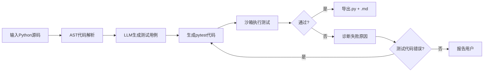

# TestGenerate Agent

> 基于 Mastra + LLM 的智能测试用例生成 Agent —— 从源代码输入到可执行 pytest 测试代码输出的全自动闭环。

[](https://www.typescriptlang.org/)
[](https://mastra.ai/)
[](https://www.python.org/)

***

## 项目简介

**TestGenerate Agent** 是一个具备自主决策能力的智能体，核心能力：

- 🧠 **自主规划**：Agent 根据输入源代码自行判断工作路径
- 🛠️ **工具调用**：LLM 做决策，工具做执行（AST 解析、pytest 执行、结果导出）
- � **自愈循环**：测试失败时自动诊断根因 → 修正测试代码 → 重新执行
- 📤 **一键导出**：生成 `.py` 测试代码 + `.md` 测试用例文档

### 核心工作流



***

## 技术栈

|     层次    | 技术                            | 说明                               |
| :-------: | ----------------------------- | -------------------------------- |
|  Agent 框架 | **Mastra** (TypeScript)       | Agent 编排、Workflow、工具注册、Studio 调试 |
|    LLM    | OpenAI / DeepSeek / Anthropic | 模型路由，一行切换                        |
|    代码解析   | Python `ast`                  | 确定性提取函数/类/参数/行号                  |
|    测试执行   | pytest + subprocess           | 沙箱隔离执行                           |
| Schema 校验 | Zod                           | 工具入参出参校验                         |

***

## 项目结构

```
testgenerate-agent/
├── src/mastra/                  ← Mastra 核心
│   ├── index.ts                 ←   入口：注册所有 Agent 和 Workflow
│   ├── agents/                  ←   3 个 Agent：测试用例、测试代码、失败诊断
│   ├── workflows/               ←   1 个 Workflow：生成主流程
│   ├── tools/                   ←   4 个 Tool：读文件、解析、执行、导出
│   └── runtime/                 ←   TypeScript → Python 桥接层
├── python-runtime/              ← Python 运行时脚本
│   ├── parse_source.py          ←   AST 代码解析
│   ├── run_pytest.py            ←   pytest 执行器
│   └── export_cases.py          ←   导出器
├── doc/                         ← 完整设计文档
│   ├── 需求分析文档.md
│   ├── 概要设计文档.md
│   └── 详细设计文档.md
└── diagrams/                    ← 架构图
    └── 系统架构图.svg
```

***

## 快速开始

### 1. 环境要求

- **Node.js** >= 22
- **Python** >= 3.10，已安装 pytest
- **LLM API Key**（OpenAI / DeepSeek 等）

### 2. 安装依赖

```bash
# Node 依赖
npm install

# Python 依赖
pip install pytest
```

### 3. 配置 API Key

编辑 `.env`：

```env
OPENAI_API_KEY=sk-你的Key
```

支持任意 Mastra 模型路由中列出的 provider，格式为 `provider/model-name`。

### 4. 启动 Mastra Studio

```bash
npm run dev
```

浏览器打开 \*\*<http://localhost:4111**，在可视化控制台调试> Agent。

### 5. CLI 一键生成

```bash
npm run build
npm run generate -- 源代码文件.py 输出目录 [最大自愈轮次]
```

**示例**：

```bash
npm run generate -- .\testdata\example.py .\output\demos 3
```

输出目录会生成：

- `test_generated.py`：可执行的 pytest 测试代码
- `test_cases.md`：测试用例文档 + 执行摘要 + 诊断说明

***

## Studio 使用指南

Mastra Studio 是开发调试利器：

| 面板            | 功能                             |
| ------------- | ------------------------------ |
| **Agents**    | 直接对话测试 Agent，观察它如何思考、何时调用工具    |
| **Workflows** | 可视化运行 Workflow，实时查看每一步的输入输出和状态 |
| **Traces**    | 查看完整的工具调用链和 Token 消耗           |

**测试 Agent**：选 `test-case-agent`，粘贴 Python 代码，看它如何调用 `parseSourceCodeTool`。

**运行 Workflow**：选 `generate-test-workflow`，填写 `file_path` 和 `output_dir`，点 Run。

***

## 设计文档

| 文档                        | 说明                   |
| ------------------------- | -------------------- |
| [需求分析文档](./doc/需求分析文档.md) | 项目背景、功能需求、约束与验收标准    |
| [概要设计文档](./doc/概要设计文档.md) | 系统架构、模块划分、Agent 运行机制 |
| [详细设计文档](./doc/详细设计文档.md) | 数据结构、诊断逻辑、版本管理       |

***

## 版本路线

|       版本      | 目标                                          |
| :-----------: | ------------------------------------------- |
|  **V1.0** 已完成 | 单文件 Python → AST 解析 → pytest 生成 → 沙箱执行 → 导出 |
| **V2.0** 正在进行 | 失败诊断 + 自愈循环 + 测试代码版本管理                      |
|  **V3.0** 待开始 | Web 账户 + 历史记录 + MySQL/Redis 持久化             |

***

