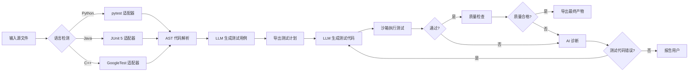
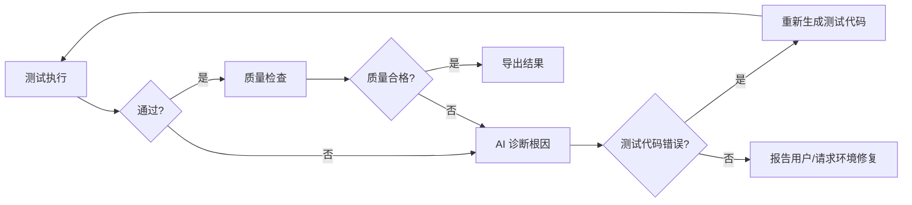

# TestGenerate Agent

> 基于 Mastra + LLM 的多语言智能测试生成 Agent —— 从源代码输入到可执行测试代码输出的全自动闭环，支持 Python、Java、C++ 三语一体。

[](https://www.typescriptlang.org/)
[](https://mastra.ai/)
[](https://www.python.org/)
[](https://www.java.com/)
[](https://isocpp.org/)

***

## 项目简介

**TestGenerate Agent** 是一个具备自主决策能力的多语言智能体，核心能力：

- 🧠 **自主规划**：Agent 根据输入源代码自行判断工作路径，支持自然语言交互
- 🌐 **多语言支持**：Python（pytest）、Java（JUnit 5）、C++（GoogleTest）一行切换
- 🛠️ **工具调用**：LLM 做决策，工具做执行（AST 解析、测试执行、质量检查、结果导出）
- 🔄 **自愈循环**：测试失败时自动诊断根因 → 修正测试代码 → 重新执行，最多可配置 20 次自愈
- 📤 **一键导出**：生成可执行测试代码 + 结构化 Markdown 测试报告（含覆盖率、版本历史、诊断详情）
- 💬 **自然语言交互**：CLI 交互模式，像聊天一样生成测试

***

## 核心工作流



***

## 技术栈

| 层次 | 技术 | 说明 |
| :---: | :--- | :--- |
| Agent 框架 | **Mastra** (TypeScript) | Agent 编排、Workflow 调度、工具注册、Studio 可视化调试 |
| LLM | DeepSeek / OpenAI | 双通道设计，chat 模型快速生成，v4-pro 模型保证重试准确率 |
| 代码解析 | Python `ast` / 正则解析 | Python 用 AST 确定性提取，Java/C++ 用正则提取函数签名 |
| 测试执行 | pytest / Maven / g++ | 沙箱隔离执行，自动超时保护 |
| Schema 校验 | Zod | 工具入参出参严格校验 |
| 内存管理 | 内置 InMemoryStore | 会话记忆、上下文摘要、事实存储 |

***

## Agent 架构

项目采用**多 Agent 协作**架构，共注册 **9 个 Agent**，分工明确：

| Agent 文件 | Agent 名称 | 职责 |
| :--- | :--- | :--- |
| `test-case-agent.ts` | 测试用例生成 Agent | 根据源代码结构设计测试用例（含边界值、异常路径） |
| `test-code-agent.ts` | 测试代码生成 Agent（标准版） | 将用例翻译为可执行测试代码 |
| `test-code-agent.ts` | 测试代码生成 Agent（Pro 版） | 自愈重试时使用，精度更高 |
| `diagnosis-agent.ts` | 失败诊断 Agent（标准版） | 分析测试失败根因，输出自然语言诊断 |
| `diagnosis-agent.ts` | 失败诊断 Agent（Pro 版） | 自愈重试时使用，精度更高 |
| `diagnosis-agent.ts` | 诊断决策 Agent | 将自然语言诊断转为结构化决策（JSON） |
| `cli-conversation-agent.ts` | CLI 对话 Agent | 理解用户自然语言需求，制定执行计划 |
| `cli-conversation-agent.ts` | CLI 意图 Agent | 对用户确认/取消/退出等意图分类 |
| `cli-conversation-agent.ts` | CLI 跟进 Agent | 工作流暂停后决定下一步操作 |

***

## 项目结构

```
testgenerate-agent/
├── src/
│   ├── cli.ts                          ← CLI 入口（命令行 + 交互模式）
│   └── mastra/
│       ├── index.ts                    ← Mastra 入口：注册所有 Agent 和 Workflow
│       ├── agents/                     ← Agent 定义（共 9 个）
│       │   ├── cli-conversation-agent.ts
│       │   ├── diagnosis-agent.ts
│       │   ├── test-case-agent.ts
│       │   └── test-code-agent.ts
│       ├── workflows/
│       │   └── generate-test-workflow.ts  ← 核心工作流（解析→用例→代码→执行→自愈→导出）
│       ├── tools/                      ← Tool 定义（共 5 个）
│       │   ├── read-file-tool.ts          读取源文件
│       │   ├── parse-source-code-tool.ts  解析源代码
│       │   ├── execute-tests-tool.ts      执行 pytest 测试
│       │   ├── check-quality-tool.ts      静态质量检查
│       │   └── export-cases-tool.ts       导出测试产物
│       ├── languages/                  ← 语言适配器（多语言抽象）
│       │   ├── types.ts                   统一类型定义
│       │   ├── registry.ts                语言注册与检测
│       │   ├── python-adapter.ts          Python + pytest
│       │   ├── java-adapter.ts            Java + JUnit 5 + Maven
│       │   └── cpp-adapter.ts             C++ + GoogleTest + g++
│       ├── runtime/                    ← 运行时基础设施
│       │   ├── env.ts                     环境变量与 LLM 连接检查
│       │   ├── command-runner.ts          命令风险评级与可见窗口执行
│       │   └── python-bridge.ts           TypeScript → Python 桥接
│       └── memory/                     ← 会话记忆
│           ├── in-memory-store.ts          内存存储引擎
│           └── session-state.ts            会话状态管理
├── python-runtime/                    ← Python 运行时脚本
│   ├── parse_source.py                AST 代码解析
│   ├── run_pytest.py                  pytest 执行器（沙箱隔离）
│   └── export_cases.py                测试报告导出器
├── doc/                               ← 完整设计文档
│   ├── 需求分析文档.md
│   ├── 需求规格说明书2.0.md
│   ├── 概要设计文档.md
│   ├── 详细设计文档.md
│   └── CLI_Agent升级落地说明.md
└── diagrams/
    └── 系统架构图.svg
```

***

## 快速开始

### 1. 环境要求

- **Node.js** >= 22
- **Python** >= 3.10，已安装 pytest
- **LLM API Key**（DeepSeek / OpenAI 等）
- （可选）Java 17+ + Maven（用于 Java 测试）
- （可选）g++ 支持 C++17（用于 C++ 测试）

### 2. 安装依赖

```bash
# Node 依赖
npm install

# Python 依赖
pip install pytest
```

### 3. 配置 API Key

在项目根目录创建 `.env` 文件：

```env
# DeepSeek（默认推荐）
DEEPSEEK_API_KEY=sk-你的Key

# 或使用 OpenAI
# OPENAI_API_KEY=sk-你的Key
```

### 4. CLI 交互模式

一句话让 Agent 干活：

```bash
npm run build
npm run generate -- --interactive
```

进入交互模式后，你可以直接说：
- "为 src/utils.py 生成测试"
- "给我的 calculator.java 写单元测试"
- "测试 cpp/sort.cpp，只生成前 5 个用例"
- "换个输出目录"

### 5. CLI 命令行模式

```bash
npm run generate -- --input ./src/example.py --output ./my-tests
```

### 6. 启动 Mastra Studio（可视化调试）

```bash
npx mastra dev
```

浏览器打开 [http://localhost:4111](http://localhost:4111)，可在可视化面板中调试 Agent 和 Workflow。

***

## CLI 选项说明

| 选项 | 简写 | 说明 | 默认值 |
| :--- | :--- | :--- | :--- |
| `--input` | `-i` | 源文件路径（支持 .py/.java/.cpp/.cc/.hpp/.h） | - |
| `--output` | `-o` | 输出目录 | `./output/exports` |
| `--language` | `-l` | 语言：python/java/cpp | auto（自动检测） |
| `--max-attempts` | - | 最大自愈尝试次数 | 3 |
| `--llm-retries` | - | 每次 LLM 请求的重试次数 | 2 |
| `--requirements` | - | 额外需求文本 | - |
| `--requirements-file` | - | 从文件读取额外需求 | - |
| `--interactive` | `-I` | 自然语言交互模式 | 关闭 |
| `--help` | `-h` | 显示帮助信息 | - |

***

## 自愈机制

Agent 最核心的能力——测试失败后自动修复：



- 每次重试自动切换 Pro 模型（DeepSeek v4-Pro）提高修复成功率
- 所有版本记录自动保存到报告中，方便追溯

***

## Studio 使用指南

Mastra Studio 是开发调试利器：`npx mastra dev`

| 面板 | 功能 |
| :--- | :--- |
| **Agents** | 直接对话任意 Agent，观察它如何思考、何时调用工具 |
| **Workflows** | 可视化运行 Workflow，实时查看每一步的输入输出和状态 |
| **Traces** | 查看完整的工具调用链和 Token 消耗 |

### 调试建议

- **测试用例 Agent**：选 `testCaseAgent`，粘贴代码片段，看它如何设计用例
- **诊断 Agent**：选 `diagnosisAgent`，粘贴失败日志，看它如何分析根因
- **运行 Workflow**：选 `generateTestWorkflow`，填写 `file_path` 和 `output_dir`，点 Run

***

## 质量保证体系

测试代码生成后，会经过层层把关：

| 关卡 | 检查项 | 说明 |
| :--- | :--- | :--- |
| 断言检查 | NO_ASSERTION | 测试代码中完全没有断言 -> 无效测试 |
| 恒真检查 | TRIVIAL_ASSERTION | `assert True`、`assert 1==1` 等永不失败的断言 |
| 函数检查 | NO_ASSERTION_IN_TEST | 某个 test 函数没有断言或异常检测 |
| 弱断言检查 | WEAK_ASSERTION | 仅检查 `is not None`、`callable`，未验证核心行为 |
| 覆盖率统计 | Symbol Coverage | 统计每个函数/方法是否被至少一个用例覆盖 |

***

## 设计文档

| 文档 | 说明 |
| :--- | :--- |
| [需求分析文档](./doc/需求分析文档.md) | 项目背景、功能需求、约束与验收标准 |
| [需求规格说明书 2.0](./doc/需求规格说明书2.0.md) | 详细需求规格 |
| [概要设计文档](./doc/概要设计文档.md) | 系统架构、模块划分、Agent 运行机制 |
| [详细设计文档](./doc/详细设计文档.md) | 数据结构、诊断逻辑、版本管理 |

***

## 版本路线

| 版本 | 目标 | 状态 |
| :---: | :--- | :---: |
| **V1.0** | 单文件 Python → AST 解析 → pytest 生成 → 沙箱执行 → 导出 | ✅ 已完成 |
| **V2.0** | 失败诊断 + 自愈循环 + 测试代码版本管理 + 质量检查 | ✅ 已完成 |
| **V2.1** | 多语言支持（Java + C++）+ 自然语言 CLI 交互 + 内存记忆 | ✅ 已完成 |
| **V3.0** | Web 面板 + 历史记录 + MySQL/Redis 持久化 | 📅 规划中 |

***

## 后续优化
1. 覆盖率（暂时是符号覆盖）需要外接工具来测试
2. 源码解析也可以用工具
3. 写一个真正的agent  
***
